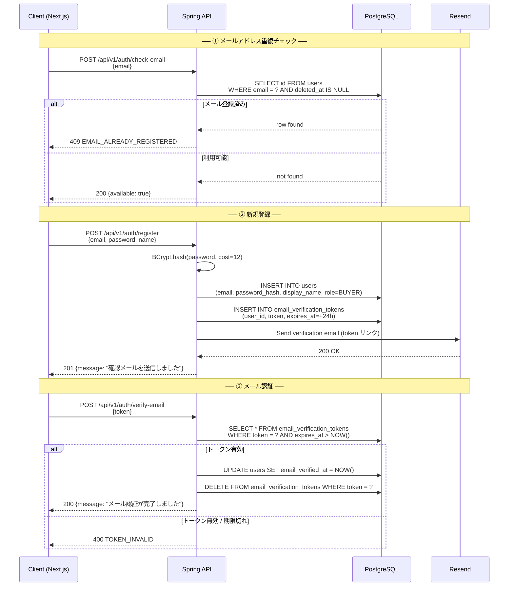
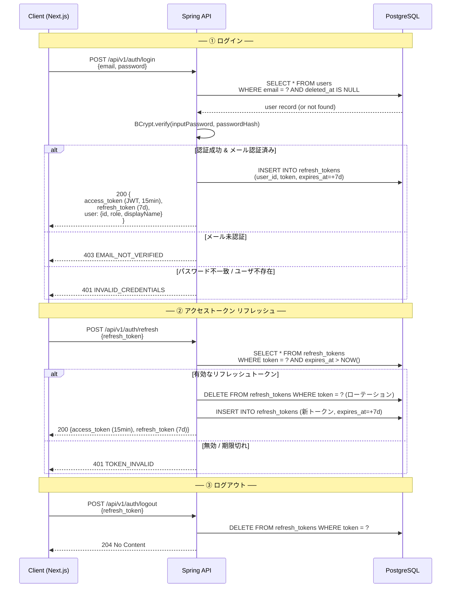
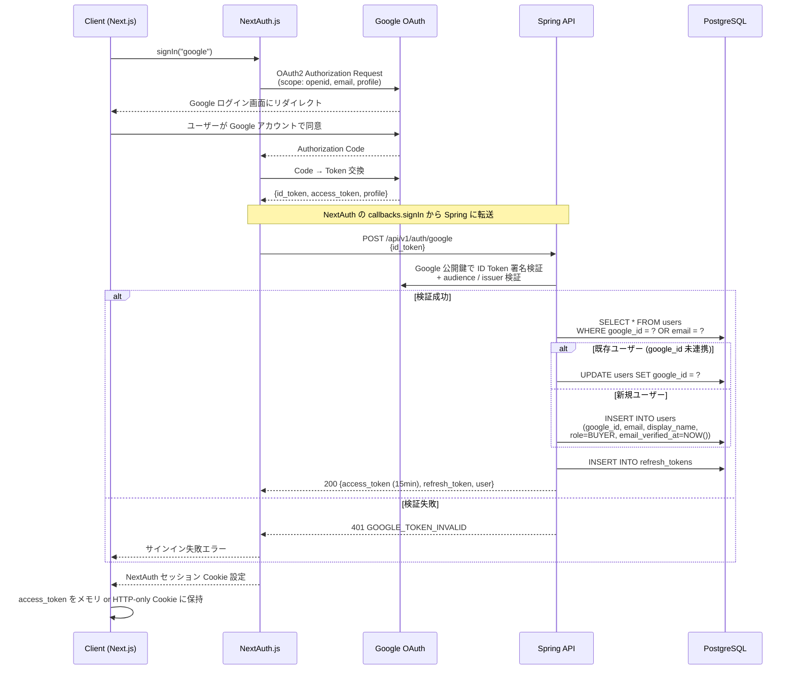
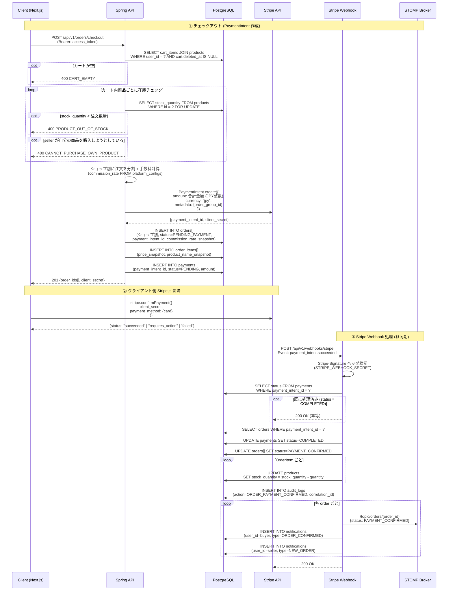
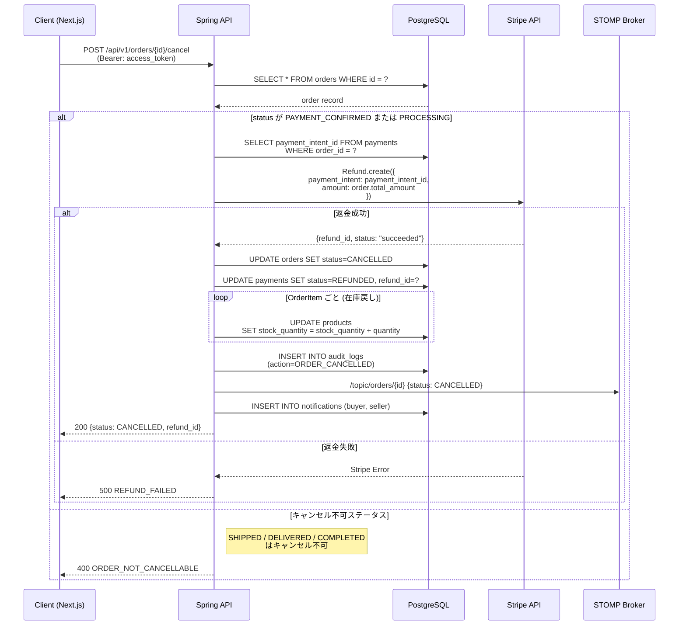
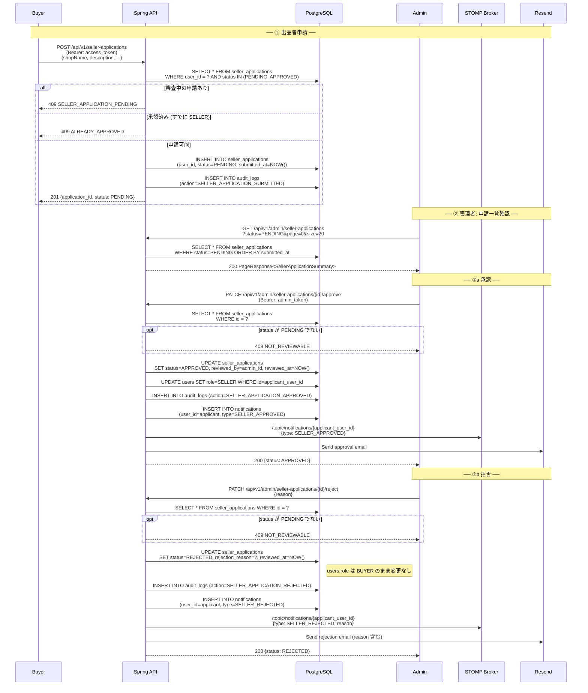
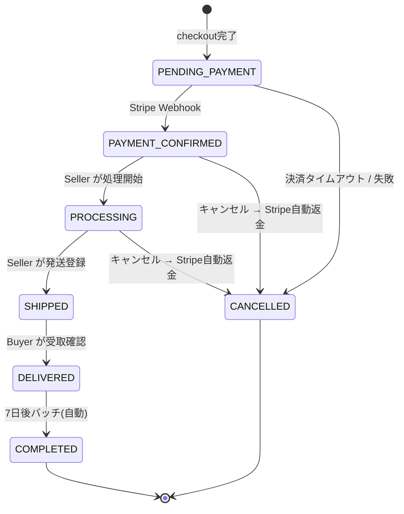
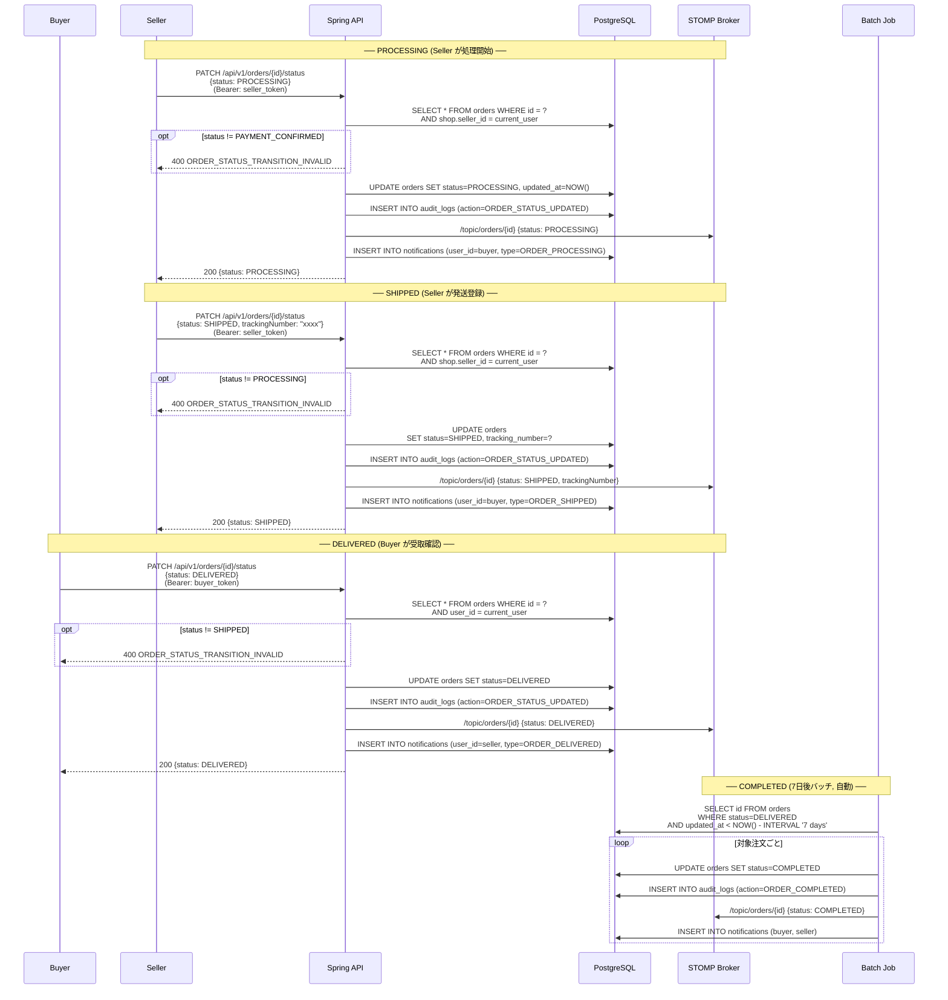

# Kivio — シーケンス図 / フロー設計書

> 図は [Mermaid](https://mermaid.js.org/) で記述。  
> 参照: `API_DESIGN.md`（エンドポイント）、`ERROR_CODES.md`（エラーコード）、`REQUIREMENTS.md`（業務ルール）

---

## 目次

1. [Auth](#1-auth)
   - [1.1 メール登録](#11-メール登録)
   - [1.2 ログイン & JWT リフレッシュ / ログアウト](#12-ログイン--jwt-リフレッシュ--ログアウト)
   - [1.3 Google OAuth (NextAuth.js フロー)](#13-google-oauth-nextauthjs-フロー)
2. [Payment](#2-payment)
   - [2.1 Stripe PaymentIntent → 注文確定](#21-stripe-paymentintent--注文確定)
   - [2.2 キャンセル & 自動返金](#22-キャンセル--自動返金)
3. [Seller Application](#3-seller-application)
4. [Order Lifecycle](#4-order-lifecycle)
   - [4.1 状態遷移図](#41-状態遷移図)
   - [4.2 ステータス更新シーケンス](#42-ステータス更新シーケンス)

---

## 1. Auth

### 1.1 メール登録

**エンドポイント:** `POST /auth/check-email` → `POST /auth/register` → `POST /auth/verify-email`

---

### 1.2 ログイン & JWT リフレッシュ / ログアウト

**エンドポイント:** `POST /auth/login` | `POST /auth/refresh` | `POST /auth/logout`

> **JWT ペイロード:** `sub` (user_id), `role`, `iat`, `exp`  
> **署名:** HS256（Phase 2） / RS256（Phase 5+）

---

### 1.3 Google OAuth (NextAuth.js フロー)

**エンドポイント:** `POST /auth/google` （Spring が Google ID Token を検証）

---

## 2. Payment

### 2.1 Stripe PaymentIntent → 注文確定

**エンドポイント:** `POST /orders/checkout` | Webhook `POST /webhooks/stripe`

---

### 2.2 キャンセル & 自動返金

**エンドポイント:** `POST /orders/{id}/cancel`

---

## 3. Seller Application

**エンドポイント:** `POST /seller-applications` | `PATCH /admin/seller-applications/{id}/approve` | `PATCH /admin/seller-applications/{id}/reject`

---

## 4. Order Lifecycle

### 4.1 状態遷移図

**ステータス変更権限まとめ:**

| 遷移 | トリガー | 実行者 |
|---|---|---|
| `PENDING_PAYMENT` → `PAYMENT_CONFIRMED` | Stripe Webhook | System (自動) |
| `PAYMENT_CONFIRMED` → `PROCESSING` | PATCH /orders/{id}/status | Seller |
| `PROCESSING` → `SHIPPED` | PATCH /orders/{id}/status | Seller |
| `SHIPPED` → `DELIVERED` | PATCH /orders/{id}/status | Buyer |
| `DELIVERED` → `COMPLETED` | バッチジョブ (7日後) | System (自動) |
| `PAYMENT_CONFIRMED` / `PROCESSING` → `CANCELLED` | POST /orders/{id}/cancel | Buyer or Seller |

---

### 4.2 ステータス更新シーケンス

---

*最終更新: 2026-05-24*
