# Kivio — シーケンス図 / フロー設計書

> 図は [Mermaid](https://mermaid.js.org/) で記述。  
> 参照: `API_DESIGN.md`（エンドポイント）、`ERROR_CODES.md`（エラーコード）、`REQUIREMENTS.md`（業務ルール）

---

## 目次

1. [Auth](#1-auth)
   - [1.1 メール登録](#11-メール登録)
   - [1.2 ログイン & JWT リフレッシュ / ログアウト](#12-ログイン--jwt-リフレッシュ--ログアウト)
   - [1.3 Google OAuth (NextAuth.js フロー)](#13-google-oauth-nextauthjs-フロー)
2. [Payment](#2-payment)
   - [2.1 Stripe PaymentIntent → 注文確定](#21-stripe-paymentintent--注文確定)
   - [2.2 キャンセル & 自動返金](#22-キャンセル--自動返金)
3. [Seller Application](#3-seller-application)
4. [Order Lifecycle](#4-order-lifecycle)
   - [4.1 状態遷移図](#41-状態遷移図)
   - [4.2 ステータス更新シーケンス](#42-ステータス更新シーケンス)

---

## 1. Auth

### 1.1 メール登録

**エンドポイント:** `POST /auth/check-email` → `POST /auth/register` → `POST /auth/verify-email`

> **設計方針 — メール認証後の自動ログイン:**  
> メール内リンクはフロントエンド URL（`/auth/verify-email?token=uuid`）に誘導する。  
> フロントエンドページがマウント時に `POST /api/v1/auth/verify-email {token}` を呼び出し、  
> 成功時に Access Token + Refresh Token を受け取ってそのままログイン状態にする。  
> トークンはリクエストボディで送信（クエリパラメータ不使用）し API サーバーログへの露出を防ぐ。  
> `router.replace('/')` でブラウザ履歴からも即時除去する。

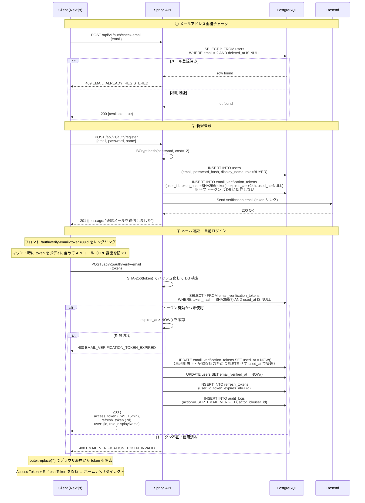
```mermaid
sequenceDiagram
    participant C as Client (Next.js)
    participant S as Spring API
    participant DB as PostgreSQL
    participant M as Resend

    Note over C,M: ── ① メールアドレス重複チェック ──
    C->>S: POST /api/v1/auth/check-email<br/>{email}
    S->>DB: SELECT id FROM users<br/>WHERE email = ? AND deleted_at IS NULL
    alt メール登録済み
        DB-->>S: row found
        S-->>C: 409 EMAIL_ALREADY_REGISTERED
    else 利用可能
        DB-->>S: not found
        S-->>C: 200 {available: true}
    end

    Note over C,M: ── ② 新規登録 ──
    C->>S: POST /api/v1/auth/register<br/>{email, password, name}
    S->>S: BCrypt.hash(password, cost=12)
    S->>DB: INSERT INTO users<br/>(email, password_hash, display_name, role=BUYER)
    S->>DB: INSERT INTO email_verification_tokens<br/>(user_id, token_hash=SHA256(token), expires_at=+24h, used_at=NULL)<br/>※ 平文トークンは DB に保存しない
    S->>M: Send verification email (token リンク)
    M-->>S: 200 OK
    S-->>C: 201 {message: "確認メールを送信しました"}

    Note over C,M: ── ③ メール認証 + 自動ログイン ──
    Note over C: フロント /auth/verify-email?token=uuid をレンダリング
    Note over C: マウント時に token をボディに含めて API コール（URL 露出を防ぐ）
    C->>S: POST /api/v1/auth/verify-email<br/>{token}
    S->>S: SHA-256(token) でハッシュ化して DB 検索
    S->>DB: SELECT * FROM email_verification_tokens<br/>WHERE token_hash = SHA256(?) AND used_at IS NULL
    alt トークン有効かつ未使用
        S->>S: expires_at > NOW() を確認
        alt 期限切れ
            S-->>C: 400 EMAIL_VERIFICATION_TOKEN_EXPIRED
        end
        S->>DB: UPDATE email_verification_tokens SET used_at = NOW()<br/>（再利用防止・記録保持のため DELETE せず used_at で管理）
        S->>DB: UPDATE users SET email_verified_at = NOW()
        S->>DB: INSERT INTO refresh_tokens<br/>(user_id, token, expires_at=+7d)
        S->>DB: INSERT INTO audit_logs<br/>(action=USER_EMAIL_VERIFIED, actor_id=user_id)
        S-->>C: 200 {<br/>  access_token (JWT, 15min),<br/>  refresh_token (7d),<br/>  user: {id, role, displayName}<br/>}
    else トークン不正 / 使用済み
        S-->>C: 400 EMAIL_VERIFICATION_TOKEN_INVALID
    end
    Note over C: router.replace('/') でブラウザ履歴から token を除去
    Note over C: Access Token + Refresh Token を保持 → ホーム / へリダイレクト
```

---

### 1.2 ログイン & JWT リフレッシュ / ログアウト

**エンドポイント:** `POST /auth/login` | `POST /auth/refresh` | `POST /auth/logout`

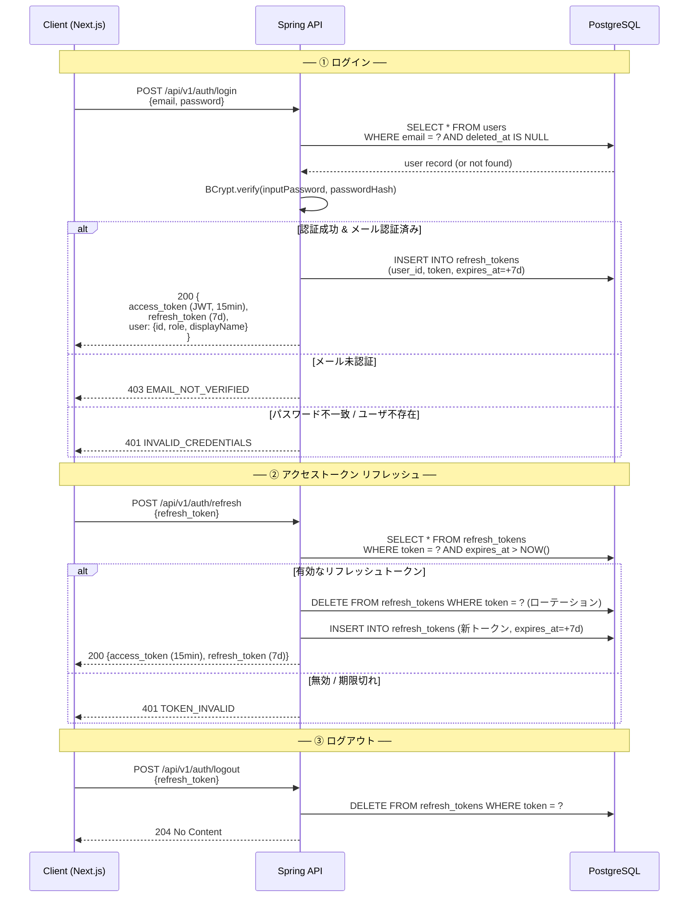
```mermaid
sequenceDiagram
    participant C as Client (Next.js)
    participant S as Spring API
    participant DB as PostgreSQL

    Note over C,DB: ── ① ログイン ──
    C->>S: POST /api/v1/auth/login<br/>{email, password}
    S->>DB: SELECT * FROM users<br/>WHERE email = ? AND deleted_at IS NULL
    DB-->>S: user record (or not found)
    S->>S: BCrypt.verify(inputPassword, passwordHash)

    alt 認証成功 & メール認証済み
        S->>DB: INSERT INTO refresh_tokens<br/>(user_id, token, expires_at=+7d)
        S-->>C: 200 {<br/>  access_token (JWT, 15min),<br/>  refresh_token (7d),<br/>  user: {id, role, displayName}<br/>}
    else メール未認証
        S-->>C: 403 EMAIL_NOT_VERIFIED
    else パスワード不一致 / ユーザ不存在
        S-->>C: 401 INVALID_CREDENTIALS
    end

    Note over C,DB: ── ② アクセストークン リフレッシュ ──
    C->>S: POST /api/v1/auth/refresh<br/>{refresh_token}
    S->>DB: SELECT * FROM refresh_tokens<br/>WHERE token = ? AND expires_at > NOW()
    alt 有効なリフレッシュトークン
        S->>DB: DELETE FROM refresh_tokens WHERE token = ?  (ローテーション)
        S->>DB: INSERT INTO refresh_tokens (新トークン, expires_at=+7d)
        S-->>C: 200 {access_token (15min), refresh_token (7d)}
    else 無効 / 期限切れ
        S-->>C: 401 TOKEN_INVALID
    end

    Note over C,DB: ── ③ ログアウト ──
    C->>S: POST /api/v1/auth/logout<br/>{refresh_token}
    S->>DB: DELETE FROM refresh_tokens WHERE token = ?
    S-->>C: 204 No Content
```

> **JWT ペイロード:** `sub` (user_id), `role`, `iat`, `exp`  
> **署名:** HS256（Phase 2） / RS256（Phase 5+）

---

### 1.3 Google OAuth (NextAuth.js フロー)

**エンドポイント:** `POST /auth/google` （Spring が Google ID Token を検証）

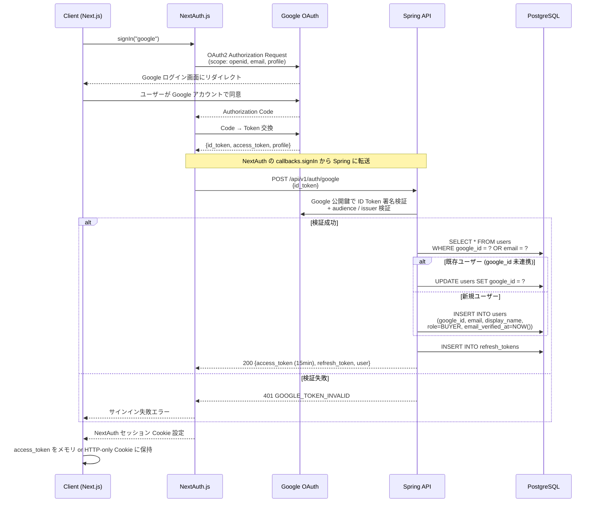
```mermaid
sequenceDiagram
    participant C as Client (Next.js)
    participant N as NextAuth.js
    participant G as Google OAuth
    participant S as Spring API
    participant DB as PostgreSQL

    C->>N: signIn("google")
    N->>G: OAuth2 Authorization Request<br/>(scope: openid, email, profile)
    G-->>C: Google ログイン画面にリダイレクト
    C->>G: ユーザーが Google アカウントで同意
    G-->>N: Authorization Code

    N->>G: Code → Token 交換
    G-->>N: {id_token, access_token, profile}

    Note over N,S: NextAuth の callbacks.signIn から Spring に転送
    N->>S: POST /api/v1/auth/google<br/>{id_token}
    S->>G: Google 公開鍵で ID Token 署名検証<br/>+ audience / issuer 検証

    alt 検証成功
        S->>DB: SELECT * FROM users<br/>WHERE google_id = ? OR email = ?
        alt 既存ユーザー (google_id 未連携)
            S->>DB: UPDATE users SET google_id = ?
        else 新規ユーザー
            S->>DB: INSERT INTO users<br/>(google_id, email, display_name,<br/>role=BUYER, email_verified_at=NOW())
        end
        S->>DB: INSERT INTO refresh_tokens
        S-->>N: 200 {access_token (15min), refresh_token, user}
    else 検証失敗
        S-->>N: 401 GOOGLE_TOKEN_INVALID
        N-->>C: サインイン失敗エラー
    end

    N-->>C: NextAuth セッション Cookie 設定
    C->>C: access_token をメモリ or HTTP-only Cookie に保持
```

---

## 2. Payment

### 2.1 Stripe PaymentIntent → 注文確定

**エンドポイント:** `POST /orders/checkout` | Webhook `POST /webhooks/stripe`

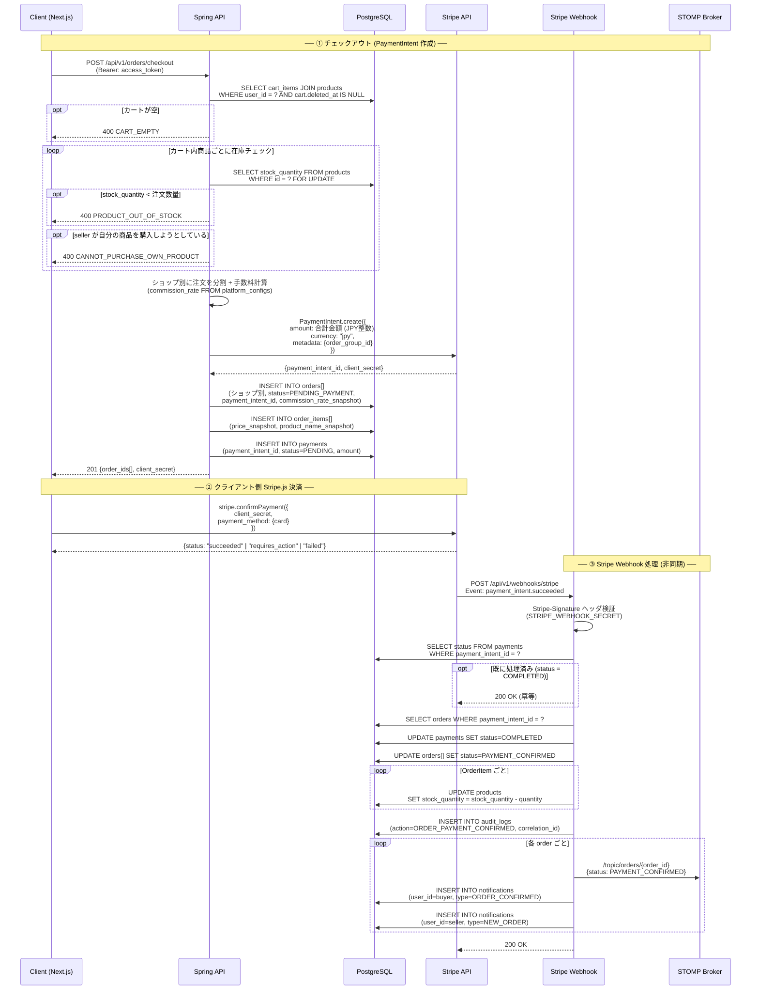
```mermaid
sequenceDiagram
    participant C as Client (Next.js)
    participant S as Spring API
    participant DB as PostgreSQL
    participant ST as Stripe API
    participant W as Stripe Webhook
    participant WS as STOMP Broker

    Note over C,WS: ── ① チェックアウト (PaymentIntent 作成) ──
    C->>S: POST /api/v1/orders/checkout<br/>(Bearer: access_token)
    S->>DB: SELECT cart_items JOIN products<br/>WHERE user_id = ? AND cart.deleted_at IS NULL

    opt カートが空
        S-->>C: 400 CART_EMPTY
    end

    loop カート内商品ごとに在庫チェック
        S->>DB: SELECT stock_quantity FROM products<br/>WHERE id = ? FOR UPDATE
        opt stock_quantity < 注文数量
            S-->>C: 400 PRODUCT_OUT_OF_STOCK
        end
        opt seller が自分の商品を購入しようとしている
            S-->>C: 400 CANNOT_PURCHASE_OWN_PRODUCT
        end
    end

    S->>S: ショップ別に注文を分割 + 手数料計算<br/>(commission_rate FROM platform_configs)
    S->>ST: PaymentIntent.create({<br/>  amount: 合計金額 (JPY整数),<br/>  currency: "jpy",<br/>  metadata: {order_group_id}<br/>})
    ST-->>S: {payment_intent_id, client_secret}

    S->>DB: INSERT INTO orders[]<br/>(ショップ別, status=PENDING_PAYMENT,<br/>payment_intent_id, commission_rate_snapshot)
    S->>DB: INSERT INTO order_items[]<br/>(price_snapshot, product_name_snapshot)
    S->>DB: INSERT INTO payments<br/>(payment_intent_id, status=PENDING, amount)
    S-->>C: 201 {order_ids[], client_secret}

    Note over C,ST: ── ② クライアント側 Stripe.js 決済 ──
    C->>ST: stripe.confirmPayment({<br/>  client_secret,<br/>  payment_method: {card}<br/>})
    ST-->>C: {status: "succeeded" | "requires_action" | "failed"}

    Note over W,WS: ── ③ Stripe Webhook 処理 (非同期) ──
    ST->>W: POST /api/v1/webhooks/stripe<br/>Event: payment_intent.succeeded
    W->>W: Stripe-Signature ヘッダ検証<br/>(STRIPE_WEBHOOK_SECRET)
    W->>DB: SELECT status FROM payments<br/>WHERE payment_intent_id = ?
    opt 既に処理済み (status = COMPLETED)
        W-->>ST: 200 OK (冪等)
    end
    W->>DB: SELECT orders WHERE payment_intent_id = ?
    W->>DB: UPDATE payments SET status=COMPLETED
    W->>DB: UPDATE orders[] SET status=PAYMENT_CONFIRMED

    loop OrderItem ごと
        W->>DB: UPDATE products<br/>SET stock_quantity = stock_quantity - quantity
    end

    W->>DB: INSERT INTO audit_logs<br/>(action=ORDER_PAYMENT_CONFIRMED, correlation_id)

    loop 各 order ごと
        W->>WS: /topic/orders/{order_id}<br/>{status: PAYMENT_CONFIRMED}
        W->>DB: INSERT INTO notifications<br/>(user_id=buyer, type=ORDER_CONFIRMED)
        W->>DB: INSERT INTO notifications<br/>(user_id=seller, type=NEW_ORDER)
    end

    W-->>ST: 200 OK
```

---

### 2.2 キャンセル & 自動返金

**エンドポイント:** `POST /orders/{id}/cancel`

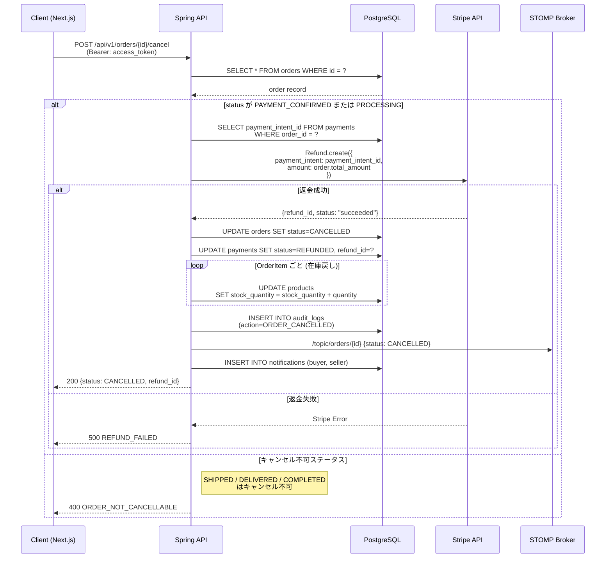
```mermaid
sequenceDiagram
    participant C as Client (Next.js)
    participant S as Spring API
    participant DB as PostgreSQL
    participant ST as Stripe API
    participant WS as STOMP Broker

    C->>S: POST /api/v1/orders/{id}/cancel<br/>(Bearer: access_token)
    S->>DB: SELECT * FROM orders WHERE id = ?
    DB-->>S: order record

    alt status が PAYMENT_CONFIRMED または PROCESSING
        S->>DB: SELECT payment_intent_id FROM payments<br/>WHERE order_id = ?
        S->>ST: Refund.create({<br/>  payment_intent: payment_intent_id,<br/>  amount: order.total_amount<br/>})
        alt 返金成功
            ST-->>S: {refund_id, status: "succeeded"}
            S->>DB: UPDATE orders SET status=CANCELLED
            S->>DB: UPDATE payments SET status=REFUNDED, refund_id=?

            loop OrderItem ごと (在庫戻し)
                S->>DB: UPDATE products<br/>SET stock_quantity = stock_quantity + quantity
            end

            S->>DB: INSERT INTO audit_logs<br/>(action=ORDER_CANCELLED)
            S->>WS: /topic/orders/{id} {status: CANCELLED}
            S->>DB: INSERT INTO notifications (buyer, seller)
            S-->>C: 200 {status: CANCELLED, refund_id}
        else 返金失敗
            ST-->>S: Stripe Error
            S-->>C: 500 REFUND_FAILED
        end
    else キャンセル不可ステータス
        Note right of S: SHIPPED / DELIVERED / COMPLETED<br/>はキャンセル不可
        S-->>C: 400 ORDER_NOT_CANCELLABLE
    end
```

---

## 3. Seller Application

**エンドポイント:** `POST /seller-applications` | `PATCH /admin/seller-applications/{id}/approve` | `PATCH /admin/seller-applications/{id}/reject`

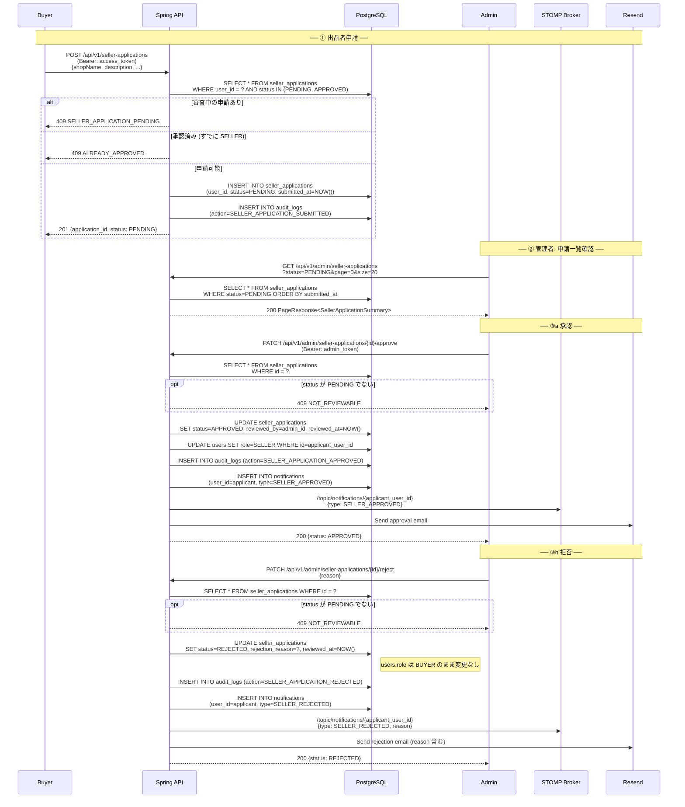
```mermaid
sequenceDiagram
    participant B as Buyer
    participant S as Spring API
    participant DB as PostgreSQL
    participant A as Admin
    participant WS as STOMP Broker
    participant M as Resend

    Note over B,M: ── ① 出品者申請 ──
    B->>S: POST /api/v1/seller-applications<br/>(Bearer: access_token)<br/>{shopName, description, ...}
    S->>DB: SELECT * FROM seller_applications<br/>WHERE user_id = ? AND status IN (PENDING, APPROVED)

    alt 審査中の申請あり
        S-->>B: 409 SELLER_APPLICATION_PENDING
    else 承認済み (すでに SELLER)
        S-->>B: 409 ALREADY_APPROVED
    else 申請可能
        S->>DB: INSERT INTO seller_applications<br/>(user_id, status=PENDING, submitted_at=NOW())
        S->>DB: INSERT INTO audit_logs<br/>(action=SELLER_APPLICATION_SUBMITTED)
        S-->>B: 201 {application_id, status: PENDING}
    end

    Note over A,M: ── ② 管理者: 申請一覧確認 ──
    A->>S: GET /api/v1/admin/seller-applications<br/>?status=PENDING&page=0&size=20
    S->>DB: SELECT * FROM seller_applications<br/>WHERE status=PENDING ORDER BY submitted_at
    S-->>A: 200 PageResponse<SellerApplicationSummary>

    Note over A,M: ── ③a 承認 ──
    A->>S: PATCH /api/v1/admin/seller-applications/{id}/approve<br/>(Bearer: admin_token)
    S->>DB: SELECT * FROM seller_applications<br/>WHERE id = ?
    opt status が PENDING でない
        S-->>A: 409 NOT_REVIEWABLE
    end
    S->>DB: UPDATE seller_applications<br/>SET status=APPROVED, reviewed_by=admin_id, reviewed_at=NOW()
    S->>DB: UPDATE users SET role=SELLER WHERE id=applicant_user_id
    S->>DB: INSERT INTO audit_logs (action=SELLER_APPLICATION_APPROVED)
    S->>DB: INSERT INTO notifications<br/>(user_id=applicant, type=SELLER_APPROVED)
    S->>WS: /topic/notifications/{applicant_user_id}<br/>{type: SELLER_APPROVED}
    S->>M: Send approval email
    S-->>A: 200 {status: APPROVED}

    Note over A,M: ── ③b 拒否 ──
    A->>S: PATCH /api/v1/admin/seller-applications/{id}/reject<br/>{reason}
    S->>DB: SELECT * FROM seller_applications WHERE id = ?
    opt status が PENDING でない
        S-->>A: 409 NOT_REVIEWABLE
    end
    S->>DB: UPDATE seller_applications<br/>SET status=REJECTED, rejection_reason=?, reviewed_at=NOW()
    Note right of DB: users.role は BUYER のまま変更なし
    S->>DB: INSERT INTO audit_logs (action=SELLER_APPLICATION_REJECTED)
    S->>DB: INSERT INTO notifications<br/>(user_id=applicant, type=SELLER_REJECTED)
    S->>WS: /topic/notifications/{applicant_user_id}<br/>{type: SELLER_REJECTED, reason}
    S->>M: Send rejection email (reason 含む)
    S-->>A: 200 {status: REJECTED}
```

---

## 4. Order Lifecycle

### 4.1 状態遷移図

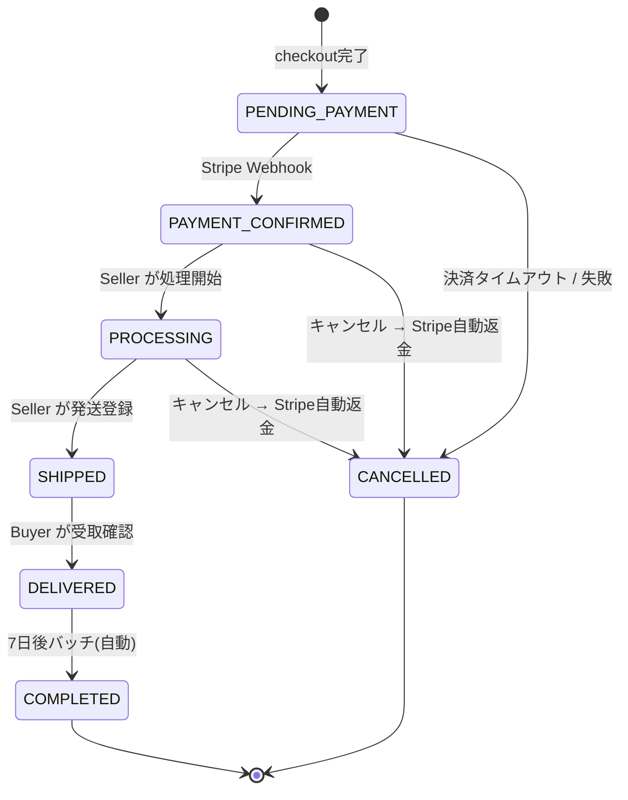
```mermaid
stateDiagram-v2
    [*] --> PENDING_PAYMENT : checkout完了

    PENDING_PAYMENT --> PAYMENT_CONFIRMED : Stripe Webhook
    PENDING_PAYMENT --> CANCELLED : 決済タイムアウト / 失敗

    PAYMENT_CONFIRMED --> PROCESSING : Seller が処理開始
    PAYMENT_CONFIRMED --> CANCELLED : キャンセル → Stripe自動返金

    PROCESSING --> SHIPPED : Seller が発送登録
    PROCESSING --> CANCELLED : キャンセル → Stripe自動返金

    SHIPPED --> DELIVERED : Buyer が受取確認

    DELIVERED --> COMPLETED : 7日後バッチ(自動)

    COMPLETED --> [*]
    CANCELLED --> [*]
```

**ステータス変更権限まとめ:**

| 遷移 | トリガー | 実行者 |
|---|---|---|
| `PENDING_PAYMENT` → `PAYMENT_CONFIRMED` | Stripe Webhook | System (自動) |
| `PAYMENT_CONFIRMED` → `PROCESSING` | PATCH /orders/{id}/status | Seller |
| `PROCESSING` → `SHIPPED` | PATCH /orders/{id}/status | Seller |
| `SHIPPED` → `DELIVERED` | PATCH /orders/{id}/status | Buyer |
| `DELIVERED` → `COMPLETED` | バッチジョブ (7日後) | System (自動) |
| `PAYMENT_CONFIRMED` / `PROCESSING` → `CANCELLED` | POST /orders/{id}/cancel | Buyer or Seller |

---

### 4.2 ステータス更新シーケンス

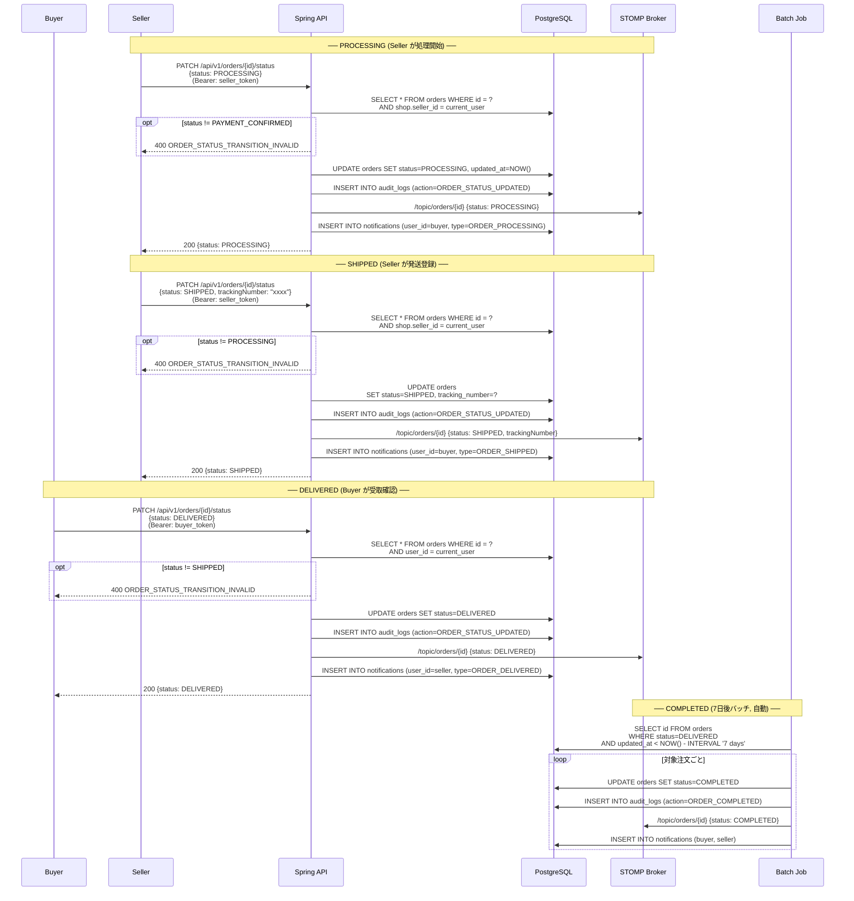
```mermaid
sequenceDiagram
    participant B as Buyer
    participant Se as Seller
    participant S as Spring API
    participant DB as PostgreSQL
    participant WS as STOMP Broker
    participant Ba as Batch Job

    Note over Se,WS: ── PROCESSING (Seller が処理開始) ──
    Se->>S: PATCH /api/v1/orders/{id}/status<br/>{status: PROCESSING}<br/>(Bearer: seller_token)
    S->>DB: SELECT * FROM orders WHERE id = ?<br/>AND shop.seller_id = current_user
    opt status != PAYMENT_CONFIRMED
        S-->>Se: 400 ORDER_STATUS_TRANSITION_INVALID
    end
    S->>DB: UPDATE orders SET status=PROCESSING, updated_at=NOW()
    S->>DB: INSERT INTO audit_logs (action=ORDER_STATUS_UPDATED)
    S->>WS: /topic/orders/{id} {status: PROCESSING}
    S->>DB: INSERT INTO notifications (user_id=buyer, type=ORDER_PROCESSING)
    S-->>Se: 200 {status: PROCESSING}

    Note over Se,WS: ── SHIPPED (Seller が発送登録) ──
    Se->>S: PATCH /api/v1/orders/{id}/status<br/>{status: SHIPPED, trackingNumber: "xxxx"}<br/>(Bearer: seller_token)
    S->>DB: SELECT * FROM orders WHERE id = ?<br/>AND shop.seller_id = current_user
    opt status != PROCESSING
        S-->>Se: 400 ORDER_STATUS_TRANSITION_INVALID
    end
    S->>DB: UPDATE orders<br/>SET status=SHIPPED, tracking_number=?
    S->>DB: INSERT INTO audit_logs (action=ORDER_STATUS_UPDATED)
    S->>WS: /topic/orders/{id} {status: SHIPPED, trackingNumber}
    S->>DB: INSERT INTO notifications (user_id=buyer, type=ORDER_SHIPPED)
    S-->>Se: 200 {status: SHIPPED}

    Note over B,WS: ── DELIVERED (Buyer が受取確認) ──
    B->>S: PATCH /api/v1/orders/{id}/status<br/>{status: DELIVERED}<br/>(Bearer: buyer_token)
    S->>DB: SELECT * FROM orders WHERE id = ?<br/>AND user_id = current_user
    opt status != SHIPPED
        S-->>B: 400 ORDER_STATUS_TRANSITION_INVALID
    end
    S->>DB: UPDATE orders SET status=DELIVERED
    S->>DB: INSERT INTO audit_logs (action=ORDER_STATUS_UPDATED)
    S->>WS: /topic/orders/{id} {status: DELIVERED}
    S->>DB: INSERT INTO notifications (user_id=seller, type=ORDER_DELIVERED)
    S-->>B: 200 {status: DELIVERED}

    Note over Ba,WS: ── COMPLETED (7日後バッチ, 自動) ──
    Ba->>DB: SELECT id FROM orders<br/>WHERE status=DELIVERED<br/>AND updated_at < NOW() - INTERVAL '7 days'
    loop 対象注文ごと
        Ba->>DB: UPDATE orders SET status=COMPLETED
        Ba->>DB: INSERT INTO audit_logs (action=ORDER_COMPLETED)
        Ba->>WS: /topic/orders/{id} {status: COMPLETED}
        Ba->>DB: INSERT INTO notifications (buyer, seller)
    end
```

---

## 5. Chat

**要件:** CHAT-01〜CHAT-06

### 5.1 チャットルーム取得 / 作成

バイヤーが商品詳細画面から「セラーへ問い合わせ」をクリックした時点で、対象ショップとのチャットルームを取得（なければ作成）する。

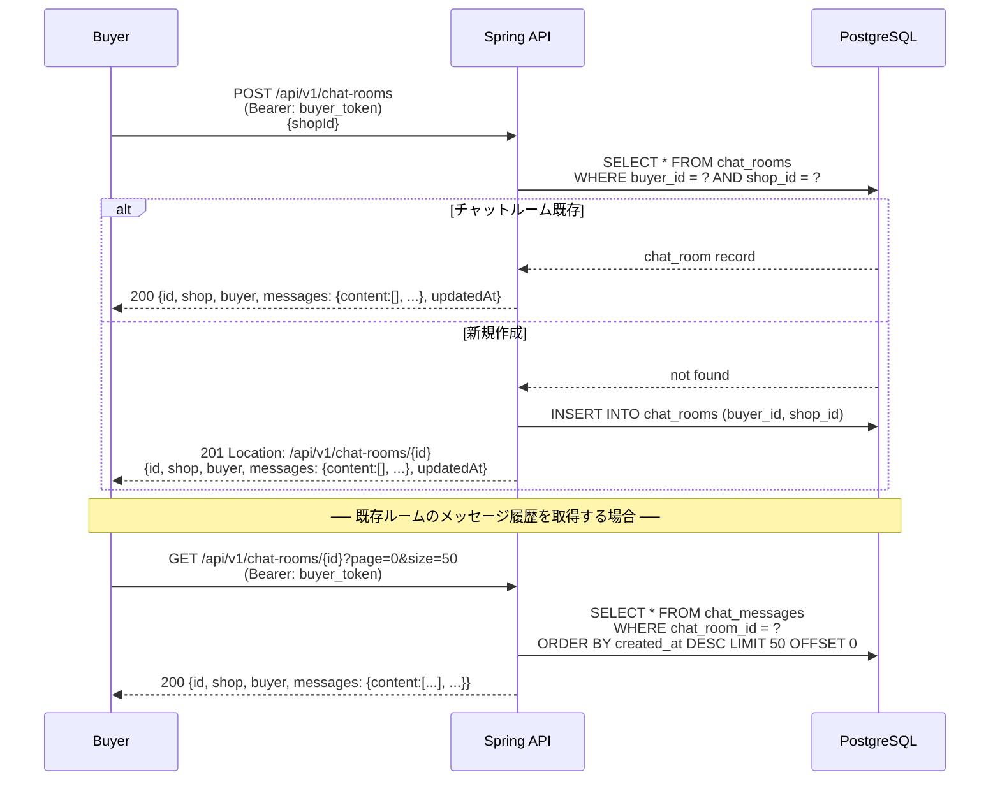
```mermaid
sequenceDiagram
    participant B as Buyer
    participant S as Spring API
    participant DB as PostgreSQL

    B->>S: POST /api/v1/chat-rooms<br/>(Bearer: buyer_token)<br/>{shopId}
    S->>DB: SELECT * FROM chat_rooms<br/>WHERE buyer_id = ? AND shop_id = ?
    alt チャットルーム既存
        DB-->>S: chat_room record
        S-->>B: 200 {id, shop, buyer, messages: {content:[], ...}, updatedAt}
    else 新規作成
        DB-->>S: not found
        S->>DB: INSERT INTO chat_rooms (buyer_id, shop_id)
        S-->>B: 201 Location: /api/v1/chat-rooms/{id}<br/>{id, shop, buyer, messages: {content:[], ...}, updatedAt}
    end

    Note over B,DB: ── 既存ルームのメッセージ履歴を取得する場合 ──
    B->>S: GET /api/v1/chat-rooms/{id}?page=0&size=50<br/>(Bearer: buyer_token)
    S->>DB: SELECT * FROM chat_messages<br/>WHERE chat_room_id = ?<br/>ORDER BY created_at DESC LIMIT 50 OFFSET 0
    S-->>B: 200 {id, shop, buyer, messages: {content:[...], ...}}
```

---

### 5.2 WebSocket 接続 & メッセージ送受信

> **JWT 配信方法:** SockJS はブラウザから WebSocket ハンドシェイク時にカスタムヘッダーを付与できないため、JWT は接続 URL のクエリパラメータで送信する（`?token=...`）。サーバーログへの露出リスクがある設計上の制約であり、Access Token の短命性（15分）で影響を最小化する。

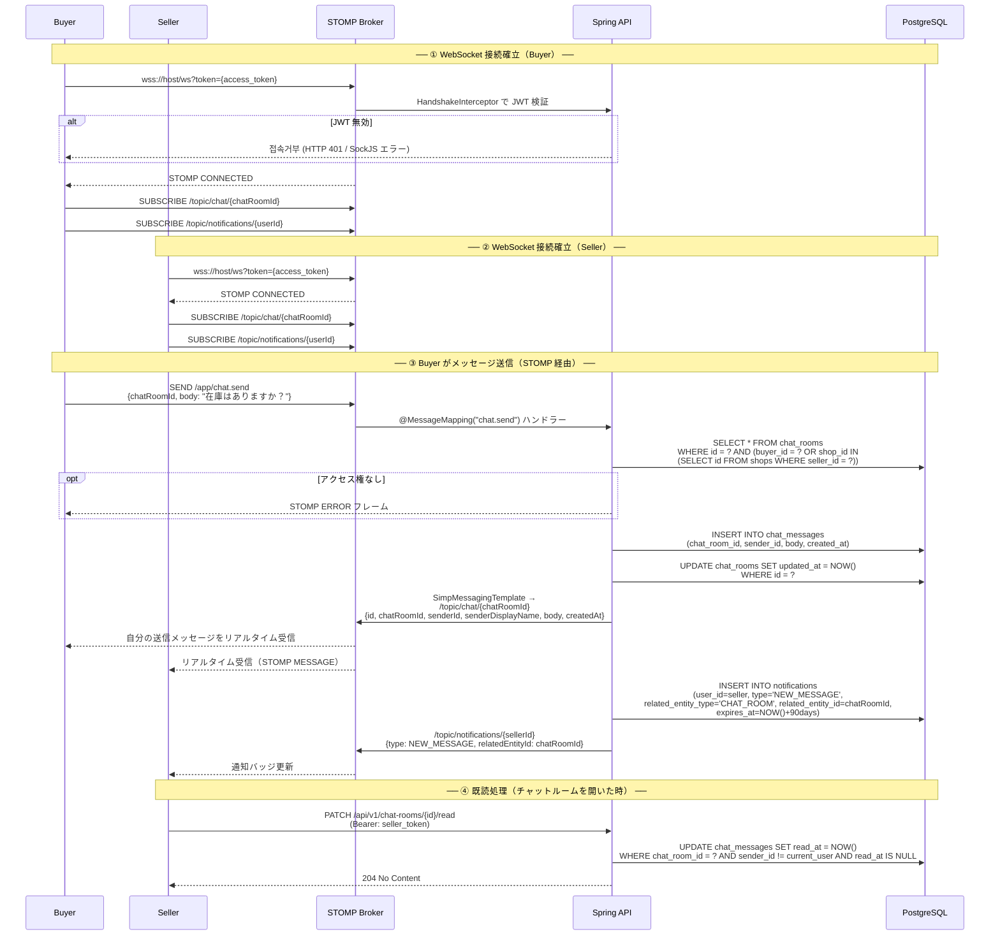
```mermaid
sequenceDiagram
    participant B as Buyer
    participant Se as Seller
    participant WS as STOMP Broker
    participant S as Spring API
    participant DB as PostgreSQL

    Note over B,DB: ── ① WebSocket 接続確立（Buyer） ──
    B->>WS: wss://host/ws?token={access_token}
    WS->>S: HandshakeInterceptor で JWT 検証
    alt JWT 無効
        S-->>B: 접속거부 (HTTP 401 / SockJS エラー)
    end
    WS-->>B: STOMP CONNECTED
    B->>WS: SUBSCRIBE /topic/chat/{chatRoomId}
    B->>WS: SUBSCRIBE /topic/notifications/{userId}

    Note over Se,DB: ── ② WebSocket 接続確立（Seller） ──
    Se->>WS: wss://host/ws?token={access_token}
    WS-->>Se: STOMP CONNECTED
    Se->>WS: SUBSCRIBE /topic/chat/{chatRoomId}
    Se->>WS: SUBSCRIBE /topic/notifications/{userId}

    Note over B,DB: ── ③ Buyer がメッセージ送信（STOMP 経由） ──
    B->>WS: SEND /app/chat.send<br/>{chatRoomId, body: "在庫はありますか？"}
    WS->>S: @MessageMapping("chat.send") ハンドラー
    S->>DB: SELECT * FROM chat_rooms<br/>WHERE id = ? AND (buyer_id = ? OR shop_id IN<br/>  (SELECT id FROM shops WHERE seller_id = ?))
    opt アクセス権なし
        S-->>B: STOMP ERROR フレーム
    end
    S->>DB: INSERT INTO chat_messages<br/>(chat_room_id, sender_id, body, created_at)
    S->>DB: UPDATE chat_rooms SET updated_at = NOW()<br/>WHERE id = ?

    S->>WS: SimpMessagingTemplate →<br/>/topic/chat/{chatRoomId}<br/>{id, chatRoomId, senderId, senderDisplayName, body, createdAt}
    WS-->>B: 自分の送信メッセージをリアルタイム受信
    WS-->>Se: リアルタイム受信（STOMP MESSAGE）

    S->>DB: INSERT INTO notifications<br/>(user_id=seller, type='NEW_MESSAGE',<br/>related_entity_type='CHAT_ROOM', related_entity_id=chatRoomId,<br/>expires_at=NOW()+90days)
    S->>WS: /topic/notifications/{sellerId}<br/>{type: NEW_MESSAGE, relatedEntityId: chatRoomId}
    WS-->>Se: 通知バッジ更新

    Note over Se,DB: ── ④ 既読処理（チャットルームを開いた時） ──
    Se->>S: PATCH /api/v1/chat-rooms/{id}/read<br/>(Bearer: seller_token)
    S->>DB: UPDATE chat_messages SET read_at = NOW()<br/>WHERE chat_room_id = ? AND sender_id != current_user AND read_at IS NULL
    S-->>Se: 204 No Content
```

---

### 5.3 チャット一覧取得（未読数付き）

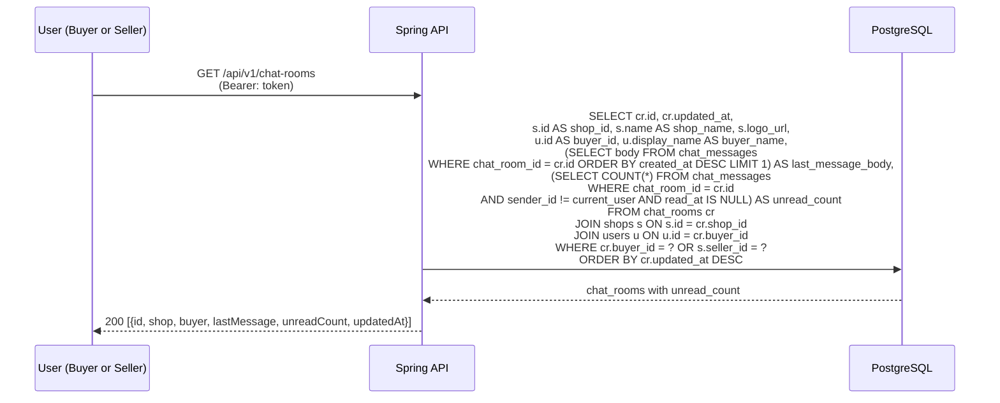
```mermaid
sequenceDiagram
    participant U as User (Buyer or Seller)
    participant S as Spring API
    participant DB as PostgreSQL

    U->>S: GET /api/v1/chat-rooms<br/>(Bearer: token)
    S->>DB: SELECT cr.id, cr.updated_at,<br/>  s.id AS shop_id, s.name AS shop_name, s.logo_url,<br/>  u.id AS buyer_id, u.display_name AS buyer_name,<br/>  (SELECT body FROM chat_messages<br/>   WHERE chat_room_id = cr.id ORDER BY created_at DESC LIMIT 1) AS last_message_body,<br/>  (SELECT COUNT(*) FROM chat_messages<br/>   WHERE chat_room_id = cr.id<br/>     AND sender_id != current_user AND read_at IS NULL) AS unread_count<br/>FROM chat_rooms cr<br/>JOIN shops s ON s.id = cr.shop_id<br/>JOIN users u ON u.id = cr.buyer_id<br/>WHERE cr.buyer_id = ? OR s.seller_id = ?<br/>ORDER BY cr.updated_at DESC
    DB-->>S: chat_rooms with unread_count
    S-->>U: 200 [{id, shop, buyer, lastMessage, unreadCount, updatedAt}]
```

---

## 6. Notification

**要件:** NOTIF-01〜NOTIF-04

### 6.1 通知一覧取得 & 既読更新

通知の WebSocket 配信自体は各イベント（§ 2.1, § 3, § 4.2, § 5.2）のシーケンス内で示している。ここではクライアントが通知を操作する REST フローを示す。

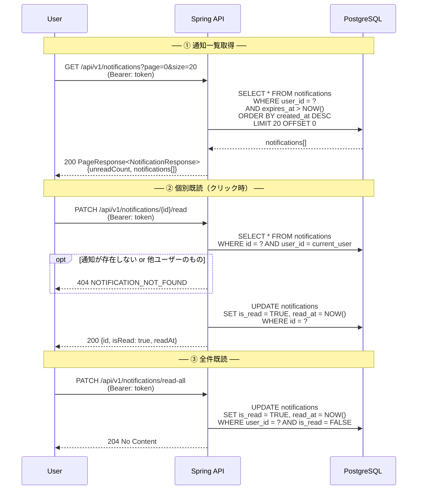
```mermaid
sequenceDiagram
    participant U as User
    participant S as Spring API
    participant DB as PostgreSQL

    Note over U,DB: ── ① 通知一覧取得 ──
    U->>S: GET /api/v1/notifications?page=0&size=20<br/>(Bearer: token)
    S->>DB: SELECT * FROM notifications<br/>WHERE user_id = ?<br/>  AND expires_at > NOW()<br/>ORDER BY created_at DESC<br/>LIMIT 20 OFFSET 0
    DB-->>S: notifications[]
    S-->>U: 200 PageResponse<NotificationResponse><br/>{unreadCount, notifications[]}

    Note over U,DB: ── ② 個別既読（クリック時） ──
    U->>S: PATCH /api/v1/notifications/{id}/read<br/>(Bearer: token)
    S->>DB: SELECT * FROM notifications<br/>WHERE id = ? AND user_id = current_user
    opt 通知が存在しない or 他ユーザーのもの
        S-->>U: 404 NOTIFICATION_NOT_FOUND
    end
    S->>DB: UPDATE notifications<br/>SET is_read = TRUE, read_at = NOW()<br/>WHERE id = ?
    S-->>U: 200 {id, isRead: true, readAt}

    Note over U,DB: ── ③ 全件既読 ──
    U->>S: PATCH /api/v1/notifications/read-all<br/>(Bearer: token)
    S->>DB: UPDATE notifications<br/>SET is_read = TRUE, read_at = NOW()<br/>WHERE user_id = ? AND is_read = FALSE
    S-->>U: 204 No Content
```

---

## 7. Review

**要件:** REV-01〜REV-04

### 7.1 レビュー投稿

**エンドポイント:** `POST /api/v1/order-items/{id}/review`

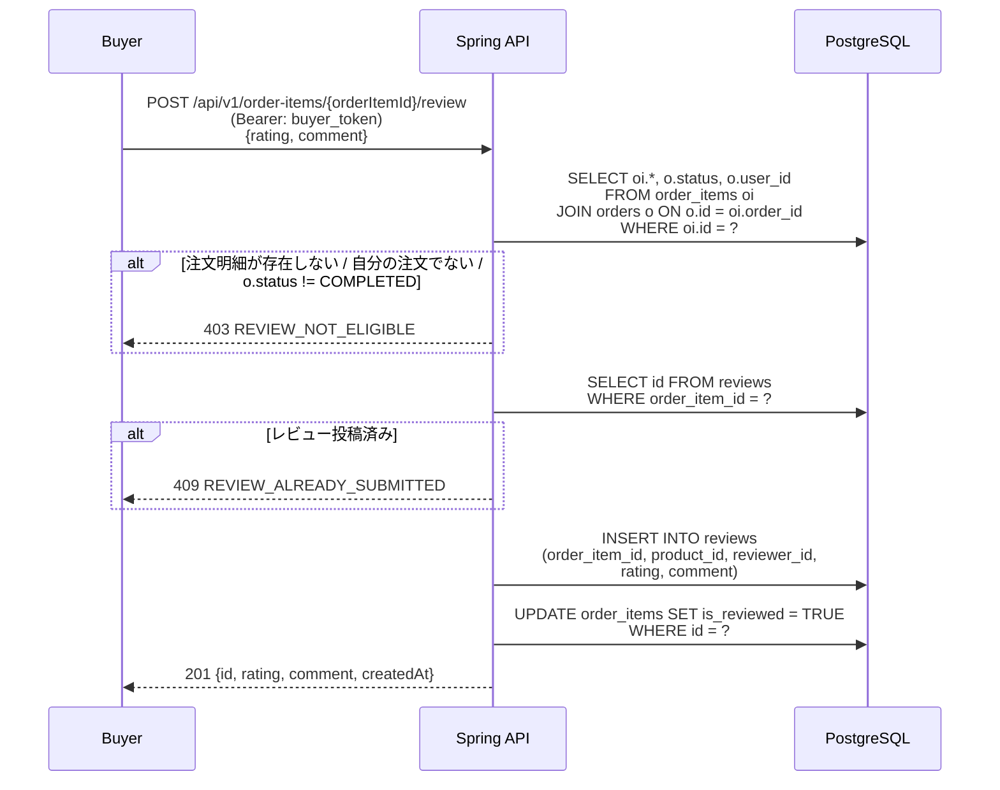
```mermaid
sequenceDiagram
    participant B as Buyer
    participant S as Spring API
    participant DB as PostgreSQL

    B->>S: POST /api/v1/order-items/{orderItemId}/review<br/>(Bearer: buyer_token)<br/>{rating, comment}
    S->>DB: SELECT oi.*, o.status, o.user_id<br/>FROM order_items oi<br/>JOIN orders o ON o.id = oi.order_id<br/>WHERE oi.id = ?
    alt 注文明細が存在しない / 自分の注文でない / o.status != COMPLETED
        S-->>B: 403 REVIEW_NOT_ELIGIBLE
    end
    S->>DB: SELECT id FROM reviews<br/>WHERE order_item_id = ?
    alt レビュー投稿済み
        S-->>B: 409 REVIEW_ALREADY_SUBMITTED
    end
    S->>DB: INSERT INTO reviews<br/>(order_item_id, product_id, reviewer_id,<br/>rating, comment)
    S->>DB: UPDATE order_items SET is_reviewed = TRUE<br/>WHERE id = ?
    S-->>B: 201 {id, rating, comment, createdAt}
```

> `products` テーブルには `avg_rating` / `review_count` カラムは存在しない。平均評価は `GET /products/{id}/reviews` のレスポンスで `reviews` テーブルを集計して返す（`summary.averageRating`）。

---

### 7.2 商品レビュー一覧取得

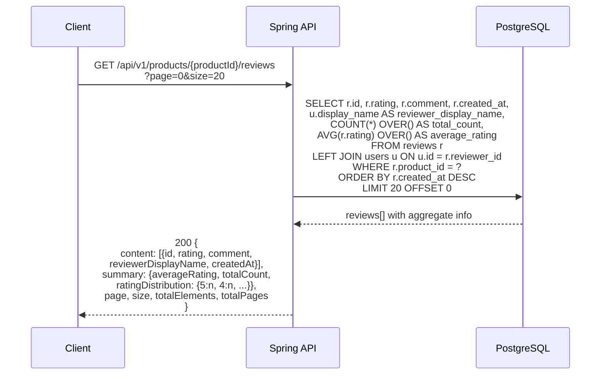
```mermaid
sequenceDiagram
    participant C as Client
    participant S as Spring API
    participant DB as PostgreSQL

    C->>S: GET /api/v1/products/{productId}/reviews<br/>?page=0&size=20
    S->>DB: SELECT r.id, r.rating, r.comment, r.created_at,<br/>  u.display_name AS reviewer_display_name,<br/>  COUNT(*) OVER() AS total_count,<br/>  AVG(r.rating) OVER() AS average_rating<br/>FROM reviews r<br/>LEFT JOIN users u ON u.id = r.reviewer_id<br/>WHERE r.product_id = ?<br/>ORDER BY r.created_at DESC<br/>LIMIT 20 OFFSET 0
    DB-->>S: reviews[] with aggregate info
    S-->>C: 200 {<br/>  content: [{id, rating, comment,<br/>    reviewerDisplayName, createdAt}],<br/>  summary: {averageRating, totalCount,<br/>    ratingDistribution: {5:n, 4:n, ...}},<br/>  page, size, totalElements, totalPages<br/>}
```

---

## 8. Wishlist

**要件:** FAV-01〜FAV-02

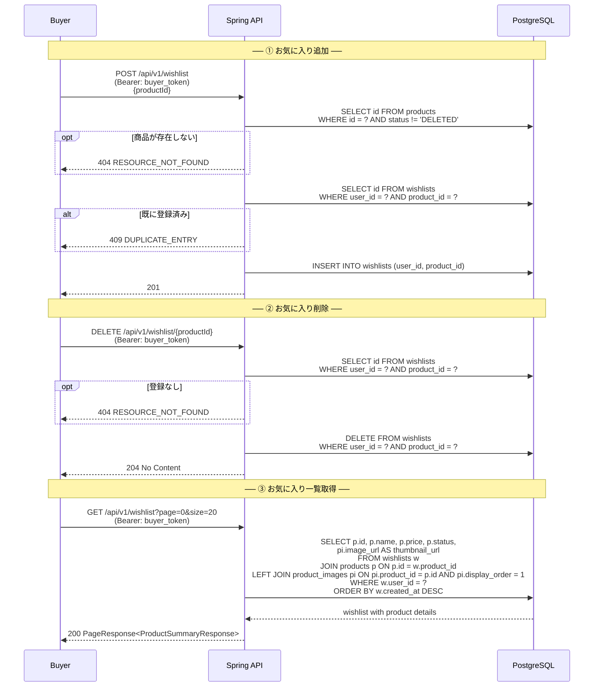
```mermaid
sequenceDiagram
    participant B as Buyer
    participant S as Spring API
    participant DB as PostgreSQL

    Note over B,DB: ── ① お気に入り追加 ──
    B->>S: POST /api/v1/wishlist<br/>(Bearer: buyer_token)<br/>{productId}
    S->>DB: SELECT id FROM products<br/>WHERE id = ? AND status != 'DELETED'
    opt 商品が存在しない
        S-->>B: 404 RESOURCE_NOT_FOUND
    end
    S->>DB: SELECT id FROM wishlists<br/>WHERE user_id = ? AND product_id = ?
    alt 既に登録済み
        S-->>B: 409 DUPLICATE_ENTRY
    end
    S->>DB: INSERT INTO wishlists (user_id, product_id)
    S-->>B: 201

    Note over B,DB: ── ② お気に入り削除 ──
    B->>S: DELETE /api/v1/wishlist/{productId}<br/>(Bearer: buyer_token)
    S->>DB: SELECT id FROM wishlists<br/>WHERE user_id = ? AND product_id = ?
    opt 登録なし
        S-->>B: 404 RESOURCE_NOT_FOUND
    end
    S->>DB: DELETE FROM wishlists<br/>WHERE user_id = ? AND product_id = ?
    S-->>B: 204 No Content

    Note over B,DB: ── ③ お気に入り一覧取得 ──
    B->>S: GET /api/v1/wishlist?page=0&size=20<br/>(Bearer: buyer_token)
    S->>DB: SELECT p.id, p.name, p.price, p.status,<br/>  pi.image_url AS thumbnail_url<br/>FROM wishlists w<br/>JOIN products p ON p.id = w.product_id<br/>LEFT JOIN product_images pi ON pi.product_id = p.id AND pi.display_order = 1<br/>WHERE w.user_id = ?<br/>ORDER BY w.created_at DESC
    DB-->>S: wishlist with product details
    S-->>B: 200 PageResponse<ProductSummaryResponse>
```

---

## 9. Batch Jobs

**要件:** RET-01〜RET-08（REQUIREMENTS § 15）  
実行エンジン: Spring `@Scheduled`（Spring Batch は現スコープでは過剰）  
全ジョブの実行結果は `audit_logs`（`actor_id = NULL`）に記録する。

### 9.1 UserAnonymizationJob（毎週日曜 3:00）

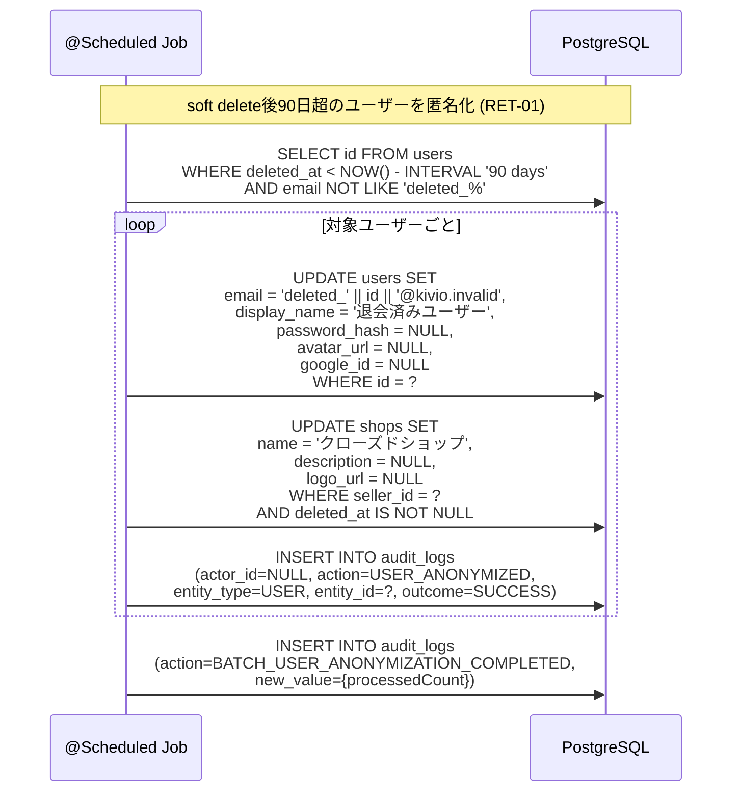
```mermaid
sequenceDiagram
    participant J as @Scheduled Job
    participant DB as PostgreSQL

    Note over J,DB: soft delete後90日超のユーザーを匿名化 (RET-01)
    J->>DB: SELECT id FROM users<br/>WHERE deleted_at < NOW() - INTERVAL '90 days'<br/>  AND email NOT LIKE 'deleted_%'
    loop 対象ユーザーごと
        J->>DB: UPDATE users SET<br/>  email = 'deleted_' || id || '@kivio.invalid',<br/>  display_name = '退会済みユーザー',<br/>  password_hash = NULL,<br/>  avatar_url = NULL,<br/>  google_id = NULL<br/>WHERE id = ?
        J->>DB: UPDATE shops SET<br/>  name = 'クローズドショップ',<br/>  description = NULL,<br/>  logo_url = NULL<br/>WHERE seller_id = ?<br/>  AND deleted_at IS NOT NULL
        J->>DB: INSERT INTO audit_logs<br/>(actor_id=NULL, action=USER_ANONYMIZED,<br/>entity_type=USER, entity_id=?, outcome=SUCCESS)
    end
    J->>DB: INSERT INTO audit_logs<br/>(action=BATCH_USER_ANONYMIZATION_COMPLETED,<br/>new_value={processedCount})
```

---

### 9.2 ProductPurgeJob（毎週日曜 3:30）

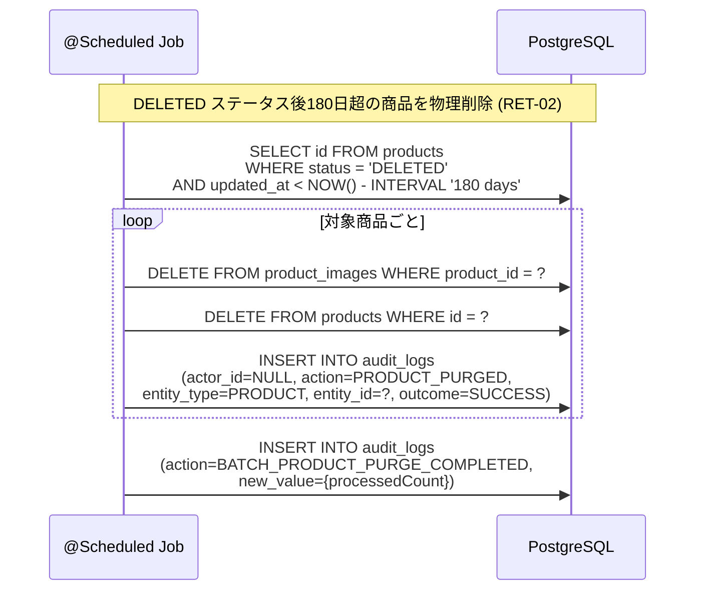
```mermaid
sequenceDiagram
    participant J as @Scheduled Job
    participant DB as PostgreSQL

    Note over J,DB: DELETED ステータス後180日超の商品を物理削除 (RET-02)
    J->>DB: SELECT id FROM products<br/>WHERE status = 'DELETED'<br/>  AND updated_at < NOW() - INTERVAL '180 days'
    loop 対象商品ごと
        J->>DB: DELETE FROM product_images WHERE product_id = ?
        J->>DB: DELETE FROM products WHERE id = ?
        J->>DB: INSERT INTO audit_logs<br/>(actor_id=NULL, action=PRODUCT_PURGED,<br/>entity_type=PRODUCT, entity_id=?, outcome=SUCCESS)
    end
    J->>DB: INSERT INTO audit_logs<br/>(action=BATCH_PRODUCT_PURGE_COMPLETED,<br/>new_value={processedCount})
```

---

### 9.3 RefreshTokenPurgeJob（毎日 2:30）

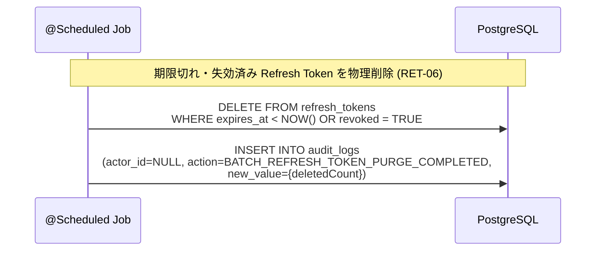
```mermaid
sequenceDiagram
    participant J as @Scheduled Job
    participant DB as PostgreSQL

    Note over J,DB: 期限切れ・失効済み Refresh Token を物理削除 (RET-06)
    J->>DB: DELETE FROM refresh_tokens<br/>WHERE expires_at < NOW() OR revoked = TRUE
    J->>DB: INSERT INTO audit_logs<br/>(actor_id=NULL, action=BATCH_REFRESH_TOKEN_PURGE_COMPLETED,<br/>new_value={deletedCount})
```

---

### 9.4 NotificationPurgeJob（毎日 2:00）

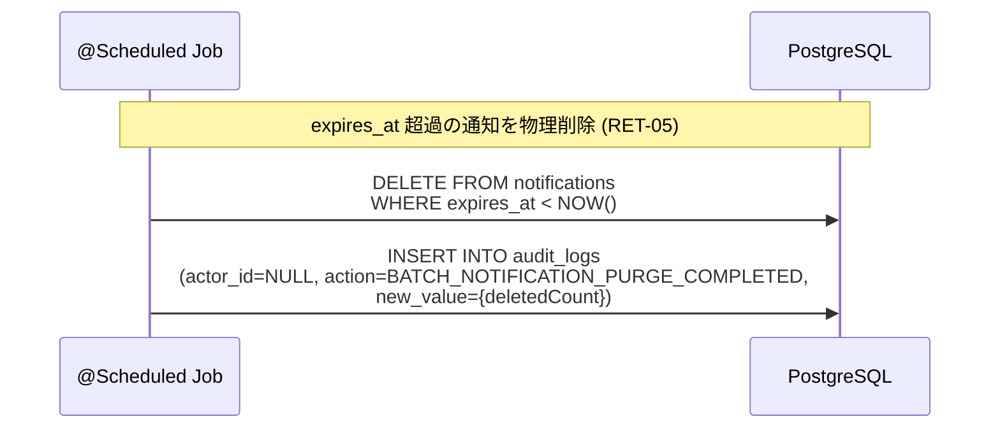
```mermaid
sequenceDiagram
    participant J as @Scheduled Job
    participant DB as PostgreSQL

    Note over J,DB: expires_at 超過の通知を物理削除 (RET-05)
    J->>DB: DELETE FROM notifications<br/>WHERE expires_at < NOW()
    J->>DB: INSERT INTO audit_logs<br/>(actor_id=NULL, action=BATCH_NOTIFICATION_PURGE_COMPLETED,<br/>new_value={deletedCount})
```

---

### 9.5 ChatMessagePurgeJob（毎月1日 4:00）

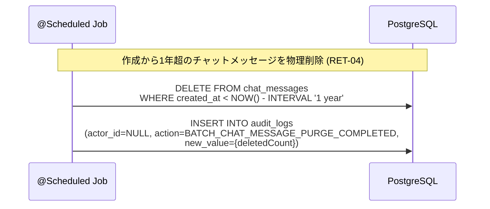
```mermaid
sequenceDiagram
    participant J as @Scheduled Job
    participant DB as PostgreSQL

    Note over J,DB: 作成から1年超のチャットメッセージを物理削除 (RET-04)
    J->>DB: DELETE FROM chat_messages<br/>WHERE created_at < NOW() - INTERVAL '1 year'
    J->>DB: INSERT INTO audit_logs<br/>(actor_id=NULL, action=BATCH_CHAT_MESSAGE_PURGE_COMPLETED,<br/>new_value={deletedCount})
```

> **注意:** チャットルーム（`chat_rooms`）はメッセージがなくなっても削除しない。ルーム自体は会話の文脈を保持するレコードのため、両ユーザーが退会（匿名化）された段階で後続の UserAnonymizationJob 判断に委ねる。

---

*最終更新: 2026-05-31*
