# ユーザーフロー図
# マルチベンダー型マーケットプレイス「Kivio」

**作成日：** 2026年5月31日  
**対象：** Phase 2（認証・ユーザー・セラー申請・ショップ・商品CRUD）  
**記法：** Mermaid flowchart

---

## 1. バイヤーフロー

### 1.1 認証フロー（新規登録）

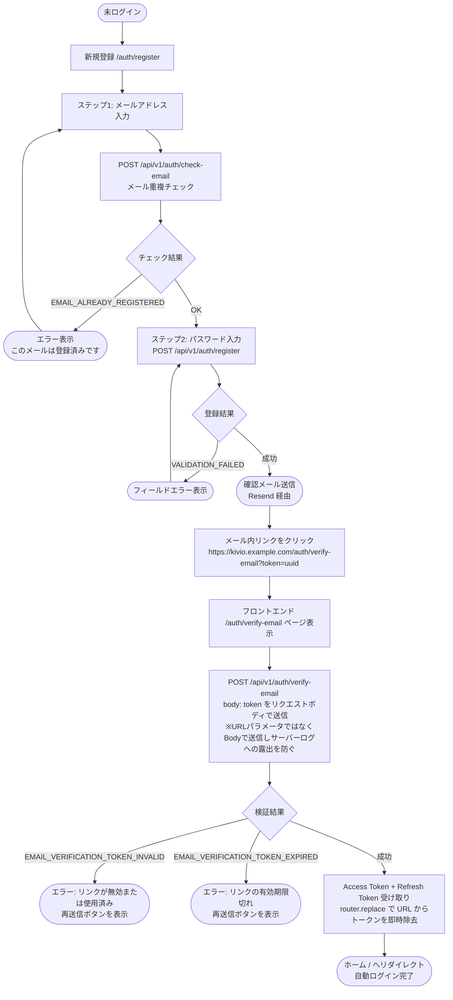
```mermaid
flowchart TD
  A([未ログイン]) --> B["新規登録 /auth/register"]
  B --> C["ステップ1: メールアドレス入力"]
  C --> D["POST /api/v1/auth/check-email\nメール重複チェック"]
  D --> DA{チェック結果}
  DA -- EMAIL_ALREADY_REGISTERED --> E(["エラー表示\nこのメールは登録済みです"])
  E --> C
  DA -- OK --> F["ステップ2: パスワード入力\nPOST /api/v1/auth/register"]
  F --> G{登録結果}
  G -- VALIDATION_FAILED --> H([フィールドエラー表示])
  H --> F
  G -- 成功 --> I(["確認メール送信\nResend 経由"])
  I --> J["メール内リンクをクリック\nhttps://kivio.example.com/auth/verify-email?token=uuid"]
  J --> K["フロントエンド /auth/verify-email ページ表示"]
  K --> L["POST /api/v1/auth/verify-email\nbody: token をリクエストボディで送信\n※URLパラメータではなくBodyで送信しサーバーログへの露出を防ぐ"]
  L --> M{検証結果}
  M -- EMAIL_VERIFICATION_TOKEN_INVALID --> N(["エラー: リンクが無効または使用済み\n再送信ボタンを表示"])
  M -- EMAIL_VERIFICATION_TOKEN_EXPIRED --> O(["エラー: リンクの有効期限切れ\n再送信ボタンを表示"])
  M -- 成功 --> PA["Access Token + Refresh Token 受け取り\nrouter.replace で URL からトークンを即時除去"]
  PA --> Q(["ホーム / へリダイレクト\n自動ログイン完了"])
```

### 1.2 認証フロー（ログイン）

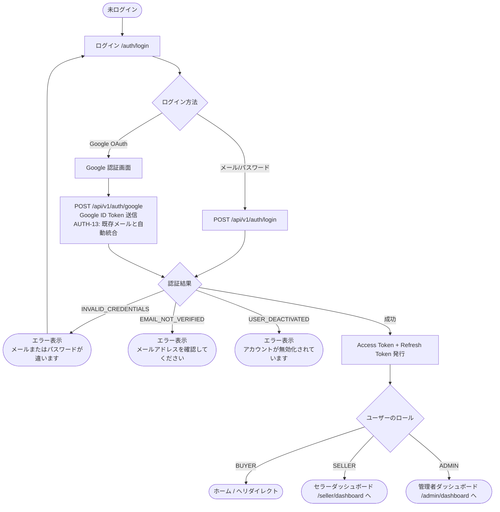
```mermaid
flowchart TD
  A([未ログイン]) --> B["ログイン /auth/login"]
  B --> C{ログイン方法}
  C -- メール/パスワード --> D["POST /api/v1/auth/login"]
  C -- Google OAuth --> E["Google 認証画面"]
  E --> F["POST /api/v1/auth/google\nGoogle ID Token 送信\nAUTH-13: 既存メールと自動統合"]
  D --> G{認証結果}
  F --> G
  G -- INVALID_CREDENTIALS --> H(["エラー表示\nメールまたはパスワードが違います"])
  H --> B
  G -- EMAIL_NOT_VERIFIED --> I(["エラー表示\nメールアドレスを確認してください"])
  G -- USER_DEACTIVATED --> J(["エラー表示\nアカウントが無効化されています"])
  G -- 成功 --> K["Access Token + Refresh Token 発行"]
  K --> L{ユーザーのロール}
  L -- BUYER --> M(["ホーム / へリダイレクト"])
  L -- SELLER --> N(["セラーダッシュボード /seller/dashboard へ"])
  L -- ADMIN --> O(["管理者ダッシュボード /admin/dashboard へ"])
```

### 1.3 未認証リダイレクトフロー

**1.3a — 認証必須ページへの直接アクセス**

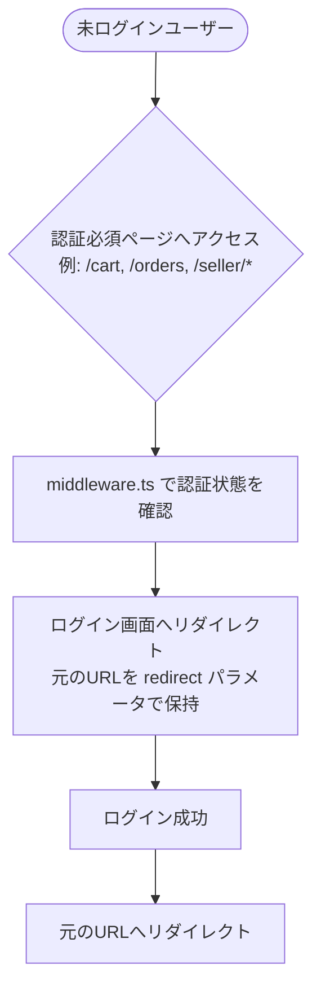
```mermaid
flowchart TD
  A([未ログインユーザー]) --> B{"認証必須ページへアクセス\n例: /cart, /orders, /seller/*"}
  B --> C["middleware.ts で認証状態を確認"]
  C --> D["ログイン画面へリダイレクト\n元のURLを redirect パラメータで保持"]
  D --> E[ログイン成功]
  E --> F[元のURLへリダイレクト]
```

**1.3b — ページ内アクション時のコンテキスト維持リダイレクト（カート追加の例）**

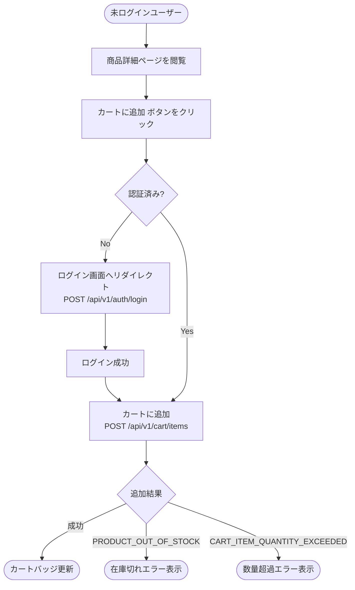
```mermaid
flowchart TD
  A([未ログインユーザー]) --> B["商品詳細ページを閲覧"]
  B --> C["カートに追加 ボタンをクリック"]
  C --> D{認証済み?}
  D -- No --> E["ログイン画面へリダイレクト\nPOST /api/v1/auth/login"]
  E --> F[ログイン成功]
  F --> G["カートに追加\nPOST /api/v1/cart/items"]
  D -- Yes --> G
  G --> H{追加結果}
  H -- 成功 --> I([カートバッジ更新])
  H -- PRODUCT_OUT_OF_STOCK --> J([在庫切れエラー表示])
  H -- CART_ITEM_QUANTITY_EXCEEDED --> K([数量超過エラー表示])
```

### 1.4 購入フロー（Phase 3 参考）

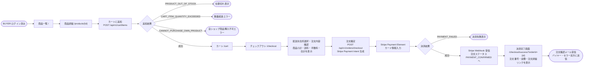
```mermaid
flowchart LR
  A([BUYER ログイン済み]) --> B["商品一覧 /"]
  B --> C["商品詳細 /products/{id}"]
  C --> D["カートに追加\nPOST /api/v1/cart/items"]
  D --> E{追加結果}
  E -- PRODUCT_OUT_OF_STOCK --> F([在庫切れ表示])
  E -- CART_ITEM_QUANTITY_EXCEEDED --> G([数量超過エラー])
  E -- CANNOT_PURCHASE_OWN_PRODUCT --> G2([自ショップ商品購入不可エラー])
  E -- 成功 --> H["カート /cart"]
  H --> I["チェックアウト /checkout"]
  I --> J["配送先住所選択・注文内容確認\n商品小計・送料・手数料・合計を表示"]
  J --> K["注文確定\nPOST /api/v1/orders/checkout\nStripe Payment Intent 生成"]
  K --> L["Stripe Payment Element\nカード情報入力"]
  L --> M{決済結果}
  M -- PAYMENT_FAILED --> N([決済失敗表示])
  M -- 成功 --> O["Stripe Webhook 受信\n注文ステータス PAYMENT_CONFIRMED へ"]
  O --> P["決済完了画面 /checkout/success?orderId={id}\n注文番号・金額・注文詳細リンクを表示"]
  P --> Q(["注文確認メール受信\nバイヤー・セラー双方に送信"])
```

---

## 2. セラーフロー

### 2.1 セラー申請フロー

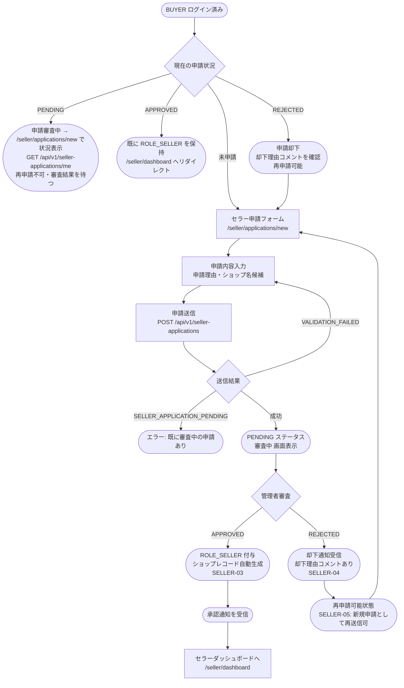
```mermaid
flowchart TD
  A([BUYER ログイン済み]) --> B{現在の申請状況}
  B -- 未申請 --> C["セラー申請フォーム\n/seller/applications/new"]
  B -- PENDING --> D(["申請審査中 → /seller/applications/new で状況表示\nGET /api/v1/seller-applications/me\n再申請不可・審査結果を待つ"])
  B -- APPROVED --> P(["既に ROLE_SELLER を保持\n/seller/dashboard へリダイレクト"])
  B -- REJECTED --> E(["申請却下\n却下理由コメントを確認\n再申請可能"])
  E --> C
  C --> F["申請内容入力\n申請理由・ショップ名候補"]
  F --> G["申請送信\nPOST /api/v1/seller-applications"]
  G --> H{送信結果}
  H -- SELLER_APPLICATION_PENDING --> I(["エラー: 既に審査中の申請あり"])
  H -- VALIDATION_FAILED --> F
  H -- 成功 --> J(["PENDING ステータス\n審査中 画面表示"])
  J --> K{管理者審査}
  K -- APPROVED --> L(["ROLE_SELLER 付与\nショップレコード自動生成\nSELLER-03"])
  L --> M(["承認通知を受信"])
  M --> N["セラーダッシュボードへ\n/seller/dashboard"]
  K -- REJECTED --> O(["却下通知受信\n却下理由コメントあり\nSELLER-04"])
  O --> Q(["再申請可能状態\nSELLER-05: 新規申請として再送信可"])
  Q --> C
```

### 2.2 商品登録フロー

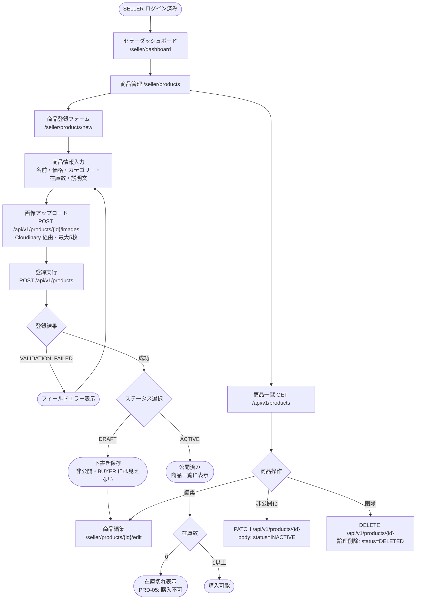
```mermaid
flowchart TD
  A([SELLER ログイン済み]) --> B["セラーダッシュボード\n/seller/dashboard"]
  B --> C["商品管理 /seller/products"]
  C --> D["商品登録フォーム\n/seller/products/new"]
  D --> E["商品情報入力\n名前・価格・カテゴリー・在庫数・説明文"]
  E --> F["画像アップロード\nPOST /api/v1/products/{id}/images\nCloudinary 経由・最大5枚"]
  F --> G["登録実行\nPOST /api/v1/products"]
  G --> GR{登録結果}
  GR -- VALIDATION_FAILED --> H([フィールドエラー表示])
  H --> E
  GR -- 成功 --> I{ステータス選択}
  I -- DRAFT --> J(["下書き保存\n非公開・BUYER には見えない"])
  I -- ACTIVE --> K(["公開済み\n商品一覧に表示"])
  J --> L["商品編集\n/seller/products/{id}/edit"]
  K --> M{在庫数}
  M -- 0 --> N(["在庫切れ表示\nPRD-05: 購入不可"])
  M -- 1以上 --> O([購入可能])

  C --> PA["商品一覧 GET /api/v1/products"]
  PA --> Q{商品操作}
  Q -- 編集 --> L
  Q -- 非公開化 --> R["PATCH /api/v1/products/{id}\nbody: status=INACTIVE"]
  Q -- 削除 --> S["DELETE /api/v1/products/{id}\n論理削除: status=DELETED"]
```

### 2.3 セラーダッシュボードフロー

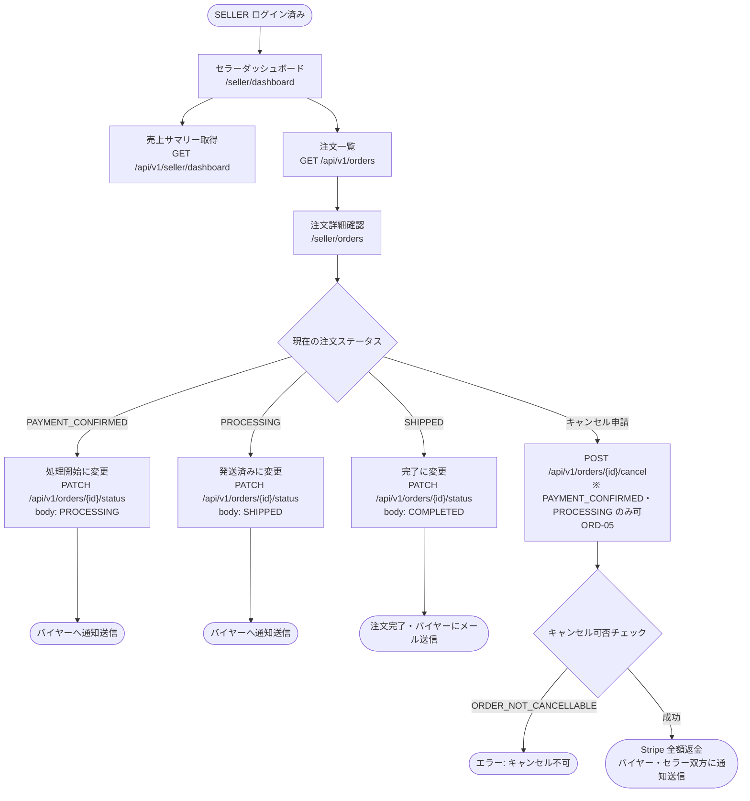
```mermaid
flowchart TD
  A([SELLER ログイン済み]) --> B["セラーダッシュボード\n/seller/dashboard"]
  B --> C["売上サマリー取得\nGET /api/v1/seller/dashboard"]
  B --> D["注文一覧\nGET /api/v1/orders"]
  D --> E["注文詳細確認\n/seller/orders"]
  E --> F{現在の注文ステータス}
  F -- PAYMENT_CONFIRMED --> G["処理開始に変更\nPATCH /api/v1/orders/{id}/status\nbody: PROCESSING"]
  F -- PROCESSING --> H["発送済みに変更\nPATCH /api/v1/orders/{id}/status\nbody: SHIPPED"]
  F -- SHIPPED --> I["完了に変更\nPATCH /api/v1/orders/{id}/status\nbody: COMPLETED"]
  G --> J([バイヤーへ通知送信])
  H --> K([バイヤーへ通知送信])
  I --> IL([注文完了・バイヤーにメール送信])
  F -- キャンセル申請 --> M["POST /api/v1/orders/{id}/cancel\n※ PAYMENT_CONFIRMED・PROCESSING のみ可\nORD-05"]
  M --> N{キャンセル可否チェック}
  N -- ORDER_NOT_CANCELLABLE --> O([エラー: キャンセル不可])
  N -- 成功 --> PA(["Stripe 全額返金\nバイヤー・セラー双方に通知送信"])
```

---

## 3. 管理者フロー

### 3.1 セラー申請承認フロー

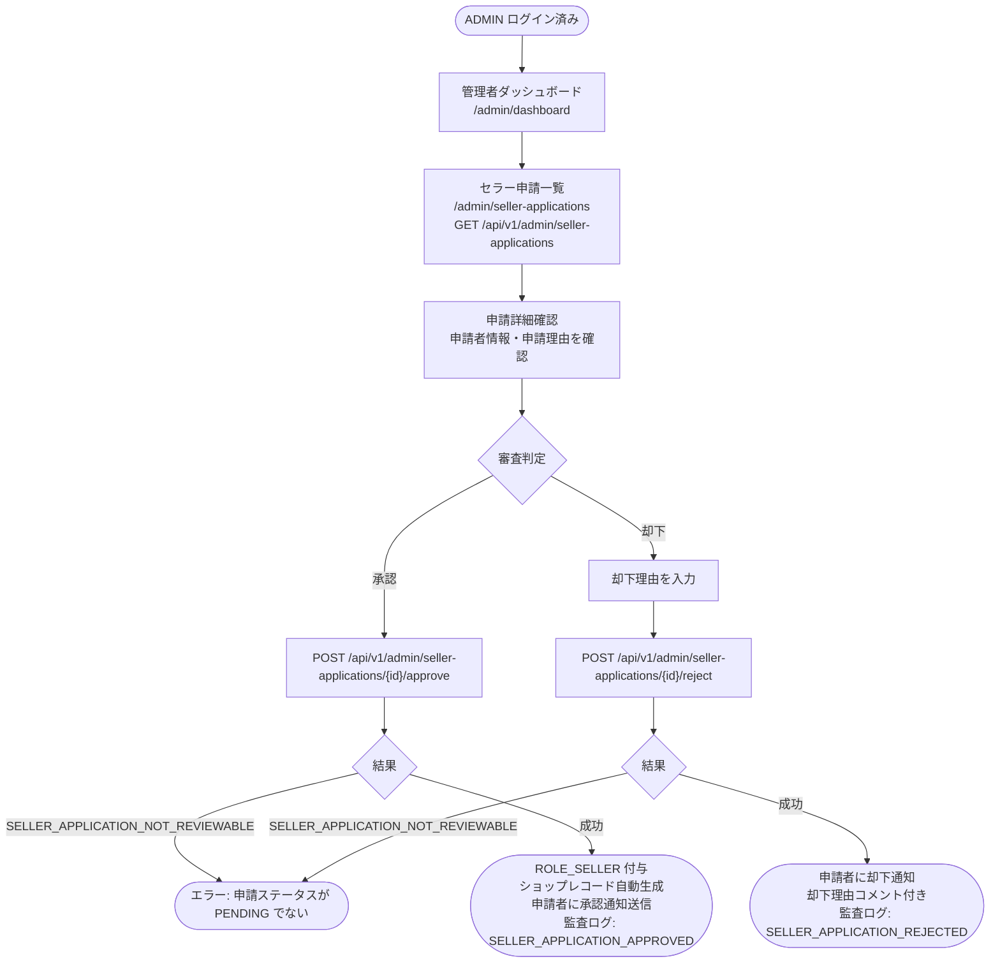
```mermaid
flowchart TD
  A([ADMIN ログイン済み]) --> B["管理者ダッシュボード\n/admin/dashboard"]
  B --> C["セラー申請一覧\n/admin/seller-applications\nGET /api/v1/admin/seller-applications"]
  C --> D["申請詳細確認\n申請者情報・申請理由を確認"]
  D --> E{審査判定}
  E -- 承認 --> F["POST /api/v1/admin/seller-applications/{id}/approve"]
  E -- 却下 --> G["却下理由を入力"]
  G --> H["POST /api/v1/admin/seller-applications/{id}/reject"]
  F --> I{結果}
  I -- SELLER_APPLICATION_NOT_REVIEWABLE --> J(["エラー: 申請ステータスが PENDING でない"])
  I -- 成功 --> K(["ROLE_SELLER 付与\nショップレコード自動生成\n申請者に承認通知送信\n監査ログ: SELLER_APPLICATION_APPROVED"])
  H --> L{結果}
  L -- SELLER_APPLICATION_NOT_REVIEWABLE --> J
  L -- 成功 --> M(["申請者に却下通知\n却下理由コメント付き\n監査ログ: SELLER_APPLICATION_REJECTED"])
```

### 3.2 ユーザー管理フロー

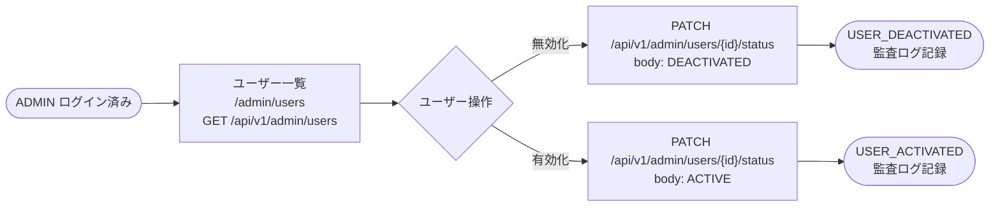
```mermaid
flowchart LR
  A([ADMIN ログイン済み]) --> B["ユーザー一覧\n/admin/users\nGET /api/v1/admin/users"]
  B --> C{ユーザー操作}
  C -- 無効化 --> D["PATCH /api/v1/admin/users/{id}/status\nbody: DEACTIVATED"]
  C -- 有効化 --> E["PATCH /api/v1/admin/users/{id}/status\nbody: ACTIVE"]
  D --> F(["USER_DEACTIVATED\n監査ログ記録"])
  E --> G(["USER_ACTIVATED\n監査ログ記録"])
```

### 3.3 商品モデレーションフロー

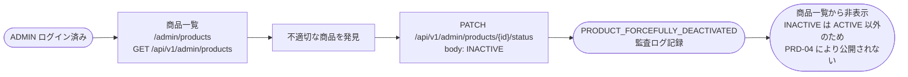
```mermaid
flowchart LR
  A([ADMIN ログイン済み]) --> B["商品一覧\n/admin/products\nGET /api/v1/admin/products"]
  B --> C["不適切な商品を発見"]
  C --> D["PATCH /api/v1/admin/products/{id}/status\nbody: INACTIVE"]
  D --> E(["PRODUCT_FORCEFULLY_DEACTIVATED\n監査ログ記録"])
  E --> F(["商品一覧から非表示\nINACTIVE は ACTIVE 以外のため\nPRD-04 により公開されない"])
```

---

## 4. 共通フロー

### 4.1 Token リフレッシュフロー

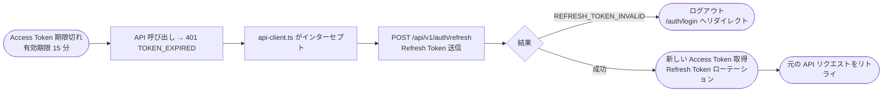
```mermaid
flowchart LR
  A(["Access Token 期限切れ\n有効期限 15 分"]) --> B["API 呼び出し → 401 TOKEN_EXPIRED"]
  B --> C["api-client.ts がインターセプト"]
  C --> D["POST /api/v1/auth/refresh\nRefresh Token 送信"]
  D --> E{結果}
  E -- REFRESH_TOKEN_INVALID --> F(["ログアウト\n/auth/login へリダイレクト"])
  E -- 成功 --> G(["新しい Access Token 取得\nRefresh Token ローテーション"])
  G --> H(["元の API リクエストをリトライ"])
```

### 4.2 通知フロー（WebSocket）

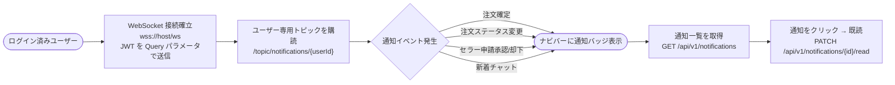
```mermaid
flowchart LR
  A([ログイン済みユーザー]) --> B["WebSocket 接続確立\nwss://host/ws\nJWT を Query パラメータで送信"]
  B --> C["ユーザー専用トピックを購読\n/topic/notifications/{userId}"]
  C --> D{通知イベント発生}
  D -- 注文確定 --> E([ナビバーに通知バッジ表示])
  D -- 注文ステータス変更 --> E
  D -- セラー申請承認/却下 --> E
  D -- 新着チャット --> E
  E --> F["通知一覧を取得\nGET /api/v1/notifications"]
  F --> G["通知をクリック → 既読\nPATCH /api/v1/notifications/{id}/read"]
```

---

## 5. Phase 3 フロー（商品検索・カート・決済・注文管理）

### 5.1 商品検索フロー

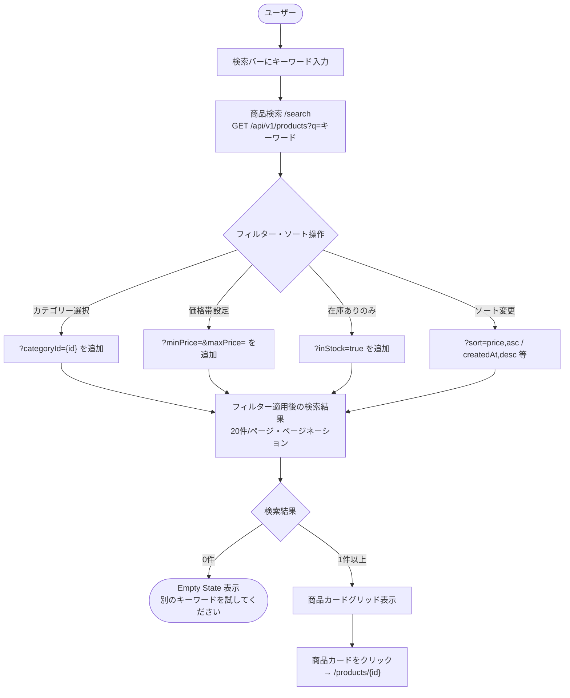
```mermaid
flowchart TD
  A([ユーザー]) --> B["検索バーにキーワード入力"]
  B --> C["商品検索 /search\nGET /api/v1/products?q=キーワード"]
  C --> D{フィルター・ソート操作}
  D -- カテゴリー選択 --> E["?categoryId={id} を追加"]
  D -- 価格帯設定 --> F["?minPrice=&maxPrice= を追加"]
  D -- 在庫ありのみ --> G["?inStock=true を追加"]
  D -- ソート変更 --> H["?sort=price,asc / createdAt,desc 等"]
  E & F & G & H --> I["フィルター適用後の検索結果\n20件/ページ・ページネーション"]
  I --> J{検索結果}
  J -- 0件 --> K(["Empty State 表示\n別のキーワードを試してください"])
  J -- 1件以上 --> L["商品カードグリッド表示"]
  L --> M["商品カードをクリック\n→ /products/{id}"]
```

### 5.2 カート操作フロー

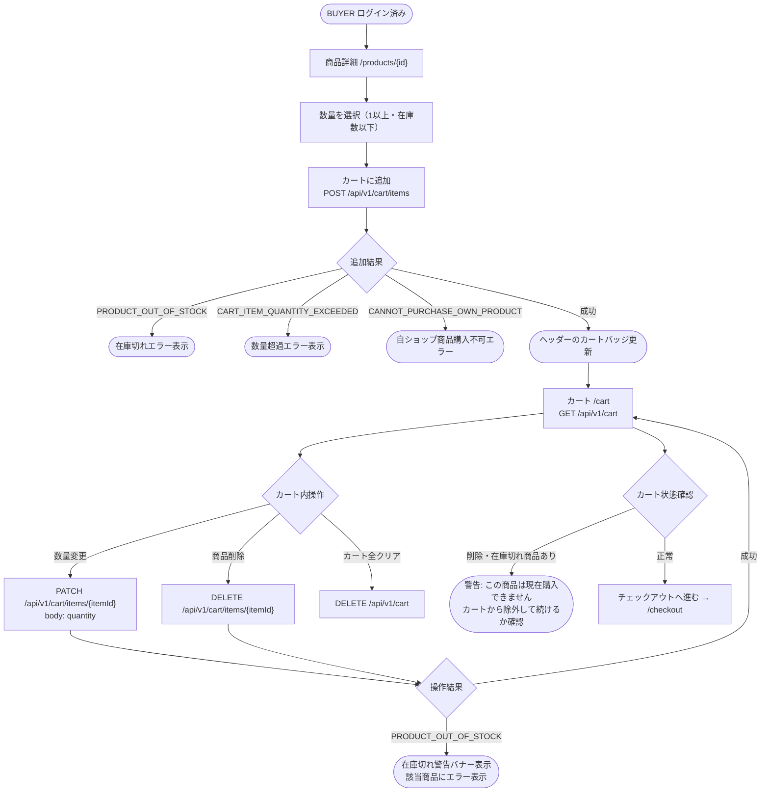
```mermaid
flowchart TD
  A([BUYER ログイン済み]) --> B["商品詳細 /products/{id}"]
  B --> C["数量を選択（1以上・在庫数以下）"]
  C --> D["カートに追加\nPOST /api/v1/cart/items"]
  D --> E{追加結果}
  E -- PRODUCT_OUT_OF_STOCK --> F([在庫切れエラー表示])
  E -- CART_ITEM_QUANTITY_EXCEEDED --> G([数量超過エラー表示])
  E -- CANNOT_PURCHASE_OWN_PRODUCT --> H([自ショップ商品購入不可エラー])
  E -- 成功 --> I(["ヘッダーのカートバッジ更新"])

  I --> J["カート /cart\nGET /api/v1/cart"]
  J --> K{カート内操作}
  K -- 数量変更 --> L["PATCH /api/v1/cart/items/{itemId}\nbody: quantity"]
  K -- 商品削除 --> M["DELETE /api/v1/cart/items/{itemId}"]
  K -- カート全クリア --> N["DELETE /api/v1/cart"]
  L & M --> O{操作結果}
  O -- PRODUCT_OUT_OF_STOCK --> P([在庫切れ警告バナー表示\n該当商品にエラー表示])
  O -- 成功 --> J

  J --> Q{カート状態確認}
  Q -- 削除・在庫切れ商品あり --> R(["警告: この商品は現在購入できません\nカートから除外して続けるか確認"])
  Q -- 正常 --> S["チェックアウトへ進む → /checkout"]
```

### 5.3 チェックアウト・Stripe 決済フロー

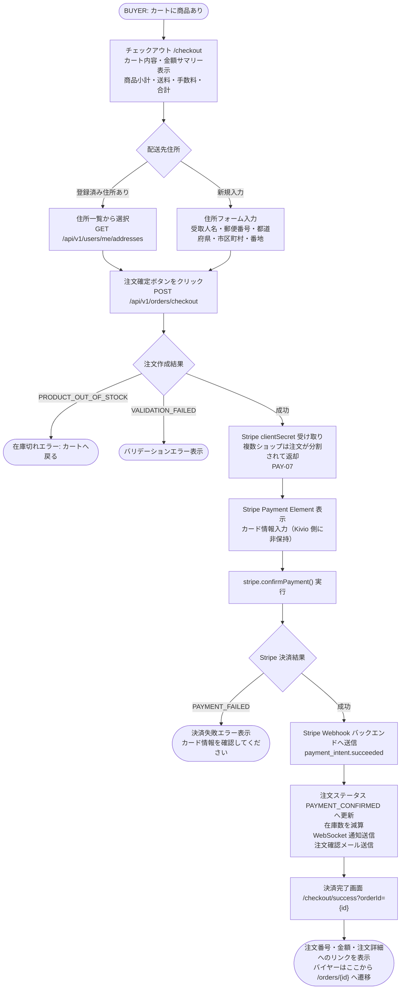
```mermaid
flowchart TD
  A([BUYER: カートに商品あり]) --> B["チェックアウト /checkout\nカート内容・金額サマリー表示\n商品小計・送料・手数料・合計"]
  B --> C{配送先住所}
  C -- 登録済み住所あり --> D["住所一覧から選択\nGET /api/v1/users/me/addresses"]
  C -- 新規入力 --> E["住所フォーム入力\n受取人名・郵便番号・都道府県・市区町村・番地"]
  D & E --> F["注文確定ボタンをクリック\nPOST /api/v1/orders/checkout"]
  F --> G{注文作成結果}
  G -- PRODUCT_OUT_OF_STOCK --> H([在庫切れエラー: カートへ戻る])
  G -- VALIDATION_FAILED --> I([バリデーションエラー表示])
  G -- 成功 --> J["Stripe clientSecret 受け取り\n複数ショップは注文が分割されて返却\nPAY-07"]
  J --> K["Stripe Payment Element 表示\nカード情報入力（Kivio 側に非保持）"]
  K --> L["stripe.confirmPayment() 実行"]
  L --> M{Stripe 決済結果}
  M -- PAYMENT_FAILED --> N(["決済失敗エラー表示\nカード情報を確認してください"])
  M -- 成功 --> O["Stripe Webhook バックエンドへ送信\npayment_intent.succeeded"]
  O --> P["注文ステータス PAYMENT_CONFIRMED へ更新\n在庫数を減算\nWebSocket 通知送信\n注文確認メール送信"]
  P --> Q["決済完了画面 /checkout/success?orderId={id}"]
  Q --> R(["注文番号・金額・注文詳細へのリンクを表示\nバイヤーはここから /orders/{id} へ遷移"])
```

### 5.4 バイヤー注文管理フロー

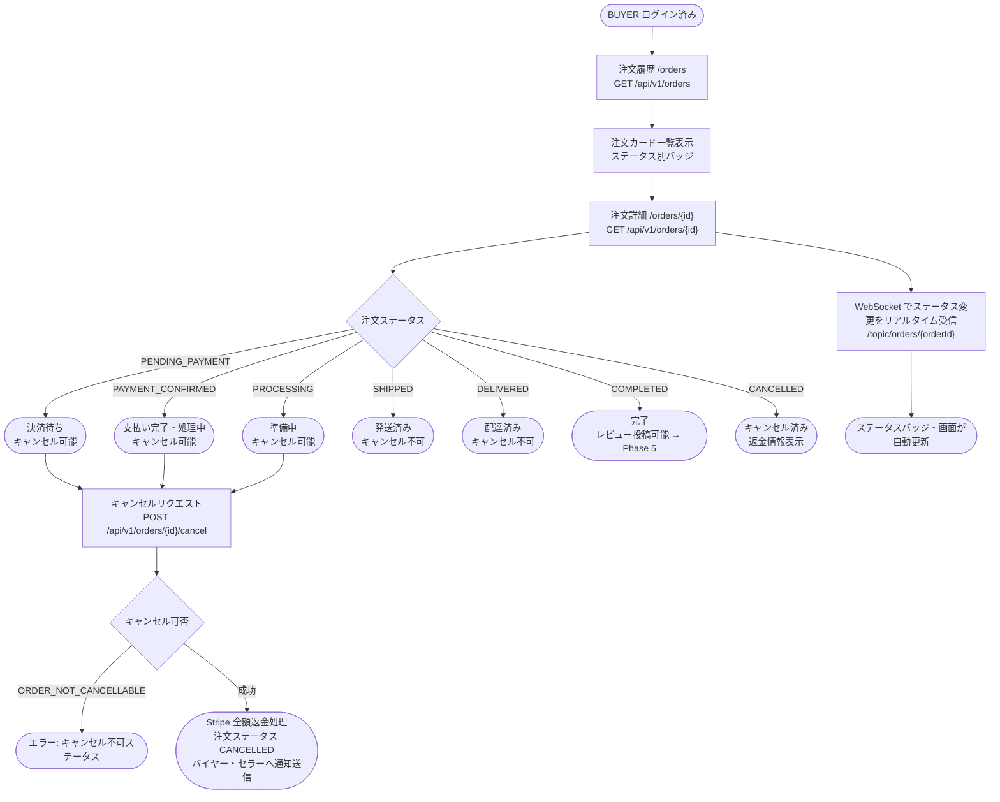
```mermaid
flowchart TD
  A([BUYER ログイン済み]) --> B["注文履歴 /orders\nGET /api/v1/orders"]
  B --> C["注文カード一覧表示\nステータス別バッジ"]
  C --> D["注文詳細 /orders/{id}\nGET /api/v1/orders/{id}"]
  D --> E{注文ステータス}
  E -- PENDING_PAYMENT --> F(["決済待ち\nキャンセル可能"])
  E -- PAYMENT_CONFIRMED --> G(["支払い完了・処理中\nキャンセル可能"])
  E -- PROCESSING --> H(["準備中\nキャンセル可能"])
  E -- SHIPPED --> I(["発送済み\nキャンセル不可"])
  E -- DELIVERED --> J(["配達済み\nキャンセル不可"])
  E -- COMPLETED --> K(["完了\nレビュー投稿可能 → Phase 5"])
  E -- CANCELLED --> L(["キャンセル済み\n返金情報表示"])
  F & G & H --> M["キャンセルリクエスト\nPOST /api/v1/orders/{id}/cancel"]
  M --> N{キャンセル可否}
  N -- ORDER_NOT_CANCELLABLE --> O([エラー: キャンセル不可ステータス])
  N -- 成功 --> P(["Stripe 全額返金処理\n注文ステータス CANCELLED\nバイヤー・セラーへ通知送信"])

  D --> Q["WebSocket でステータス変更をリアルタイム受信\n/topic/orders/{orderId}"]
  Q --> R([ステータスバッジ・画面が自動更新])
```

### 5.5 セラー注文受付・ステータス更新フロー

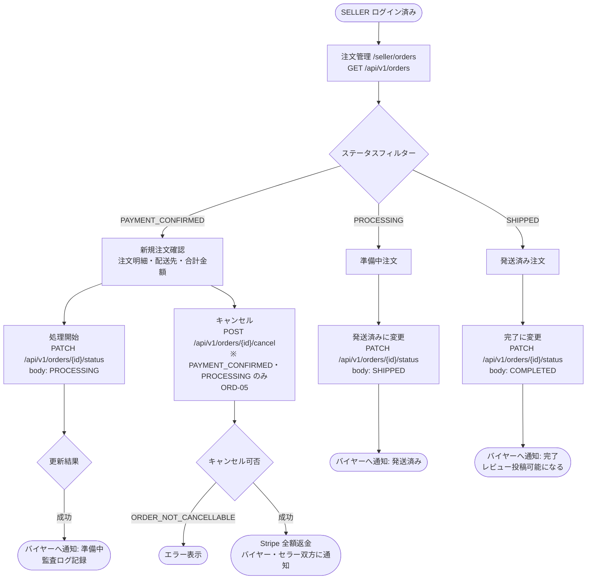
```mermaid
flowchart TD
  A([SELLER ログイン済み]) --> B["注文管理 /seller/orders\nGET /api/v1/orders"]
  B --> C{ステータスフィルター}
  C -- PAYMENT_CONFIRMED --> D["新規注文確認\n注文明細・配送先・合計金額"]
  C -- PROCESSING --> E["準備中注文"]
  C -- SHIPPED --> F["発送済み注文"]
  D --> G["処理開始\nPATCH /api/v1/orders/{id}/status\nbody: PROCESSING"]
  G --> H{更新結果}
  H -- 成功 --> I(["バイヤーへ通知: 準備中\n監査ログ記録"])
  E --> J["発送済みに変更\nPATCH /api/v1/orders/{id}/status\nbody: SHIPPED"]
  J --> K(["バイヤーへ通知: 発送済み"])
  F --> L["完了に変更\nPATCH /api/v1/orders/{id}/status\nbody: COMPLETED"]
  L --> M(["バイヤーへ通知: 完了\nレビュー投稿可能になる"])
  D --> N["キャンセル\nPOST /api/v1/orders/{id}/cancel\n※ PAYMENT_CONFIRMED・PROCESSING のみ\nORD-05"]
  N --> O{キャンセル可否}
  O -- ORDER_NOT_CANCELLABLE --> P([エラー表示])
  O -- 成功 --> Q(["Stripe 全額返金\nバイヤー・セラー双方に通知"])
```

---

## 6. Phase 4 フロー（チャット・通知・管理者機能）

### 6.1 チャット開始フロー（バイヤー → セラー）

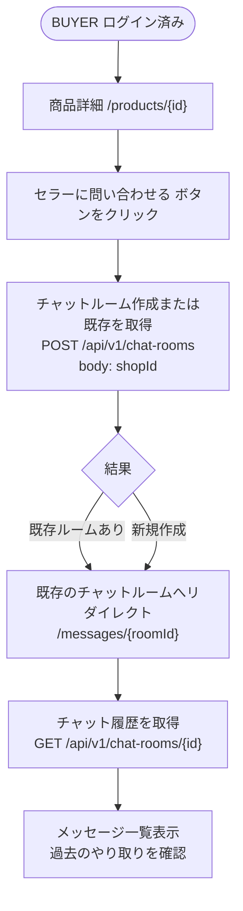
```mermaid
flowchart TD
  A([BUYER ログイン済み]) --> B["商品詳細 /products/{id}"]
  B --> C["セラーに問い合わせる ボタンをクリック"]
  C --> D["チャットルーム作成または既存を取得\nPOST /api/v1/chat-rooms\nbody: shopId"]
  D --> E{結果}
  E -- 既存ルームあり --> F["既存のチャットルームへリダイレクト\n/messages/{roomId}"]
  E -- 新規作成 --> F
  F --> G["チャット履歴を取得\nGET /api/v1/chat-rooms/{id}"]
  G --> H["メッセージ一覧表示\n過去のやり取りを確認"]
```

### 6.2 チャット・リアルタイムメッセージフロー

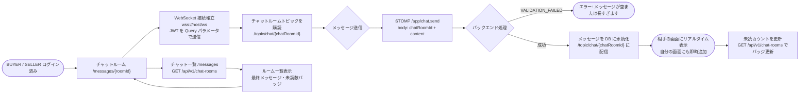
```mermaid
flowchart LR
  A([BUYER / SELLER ログイン済み]) --> B["チャットルーム /messages/{roomId}"]
  B --> C["WebSocket 接続確立\nwss://host/ws\nJWT を Query パラメータで送信"]
  C --> D["チャットルームトピックを購読\n/topic/chat/{chatRoomId}"]
  D --> E{メッセージ送信}
  E --> F["STOMP /app/chat.send\nbody: chatRoomId + content"]
  F --> G{バックエンド処理}
  G -- VALIDATION_FAILED --> H([エラー: メッセージが空または長すぎます])
  G -- 成功 --> I["メッセージを DB に永続化\n/topic/chat/{chatRoomId} に配信"]
  I --> J([相手の画面にリアルタイム表示\n自分の画面にも即時追加])
  J --> K["未読カウントを更新\nGET /api/v1/chat-rooms でバッジ更新"]

  B --> L["チャット一覧 /messages\nGET /api/v1/chat-rooms"]
  L --> M["ルーム一覧表示\n最終メッセージ・未読数バッジ"]
  M --> B
```

### 6.3 通知管理フロー（詳細版）

```mermaid
flowchart TD
  A([ログイン済みユーザー]) --> B["ナビバーの通知ベルをクリック"]
  B --> C["通知ドロップダウン表示\nGET /api/v1/notifications?size=10"]
  C --> D{通知操作}
  D -- 個別通知をクリック --> E["PATCH /api/v1/notifications/{id}/read\n既読に変更"]
  E --> F["通知に関連するページへ遷移\n注文詳細・チャット・申請結果等"]
  D -- すべて既読 --> G["PATCH /api/v1/notifications/read-all"]
  G --> H([ベルアイコンのバッジが消える])
  D -- 通知一覧を見る --> I["全通知一覧\n（ドロップダウン内スクロールまたは専用ページ）"]
  I --> J{フィルター}
  J -- 未読のみ --> K["未読通知を抽出表示"]
  J -- 全件 --> L["全通知を日時降順で表示\n90日以内のみ NOTIF-03"]
```

### 6.4 管理者カテゴリー管理フロー

```mermaid
flowchart TD
  A([ADMIN ログイン済み]) --> B["カテゴリー管理 /admin/categories\nGET /api/v1/admin/categories"]
  B --> C["カテゴリーツリー表示\n親カテゴリー・子カテゴリー階層"]
  C --> D{操作}
  D -- 新規作成 --> E["カテゴリー作成フォーム\n名前・スラッグ・親カテゴリー・表示順序"]
  E --> F["POST /api/v1/admin/categories"]
  F --> G{結果}
  G -- DUPLICATE_ENTRY --> H([エラー: 同名カテゴリーが存在します])
  G -- 成功 --> I(["カテゴリー一覧に追加"])
  D -- 編集 --> J["インライン編集フォーム"]
  J --> K["PATCH /api/v1/admin/categories/{id}"]
  K --> L([更新完了])
  D -- 削除 --> M["削除確認ダイアログ\n紐づき商品がある場合の警告表示"]
  M -- 確認 --> N["DELETE /api/v1/admin/categories/{id}\n論理削除: deleted_at"]
  N --> O{結果}
  O -- 成功 --> P(["カテゴリーが非表示に\n商品の category_id は保持"])
  M -- キャンセル --> C
```

### 6.5 プラットフォーム設定フロー

```mermaid
flowchart TD
  A([ADMIN ログイン済み]) --> B["プラットフォーム設定 /admin/platform-configs\nGET /api/v1/admin/platform-configs"]
  B --> C["設定一覧表示\nキー・現在値・説明"]
  C --> D["手数料率を変更\n commission_rate の行をクリック"]
  D --> E["インライン編集フォーム\n新しい値を入力（例: 0.05 = 5%）"]
  E --> F["PATCH /api/v1/admin/platform-configs/{key}"]
  F --> G{更新結果}
  G -- VALIDATION_FAILED --> H([バリデーションエラー: 0〜1の小数で入力])
  G -- 成功 --> I(["設定値を更新\n監査ログ: PLATFORM_CONFIG_UPDATED\n以降の注文に新手数料率が適用"])
```

### 6.6 管理者ダッシュボードフロー

```mermaid
flowchart LR
  A([ADMIN ログイン済み]) --> B["管理者ダッシュボード /admin/dashboard\nGET /api/v1/admin/dashboard"]
  B --> C["KPI カード表示\n総ユーザー数・総注文数・総売上"]
  B --> D["PENDING セラー申請数\n→ /admin/seller-applications へのリンク"]
  B --> E["最近の注文一覧（直近10件）"]
  B --> F["ユーザー増加推移グラフ（Should）"]
  D --> G["セラー申請管理 /admin/seller-applications"]
```

---

## 7. Phase 5 フロー（レビュー・お気に入り・メール通知）

### 7.1 レビュー投稿フロー

```mermaid
flowchart TD
  A([BUYER: 注文ステータスが COMPLETED]) --> B["注文詳細 /orders/{id}"]
  B --> C["レビューを書く ボタンが表示\n※ COMPLETED かつ未レビューの注文明細のみ REV-01 REV-02"]
  C --> D["商品詳細 /products/{id} のレビュータブ\nまたはモーダルでレビューフォーム表示"]
  D --> E["評価（星1〜5）を選択"]
  E --> F["コメント入力（任意）"]
  F --> G["レビュー投稿\nPOST /api/v1/order-items/{id}/review"]
  G --> H{投稿結果}
  H -- REVIEW_ALREADY_EXISTS --> I([エラー: このアイテムのレビューは投稿済みです])
  H -- ORDER_NOT_COMPLETED --> J([エラー: 注文が完了していません])
  H -- VALIDATION_FAILED --> K([バリデーションエラー: 評価は1〜5で入力])
  H -- 成功 --> L(["レビューが商品詳細に反映\n平均評価・レビュー件数が更新"])
  L --> M["商品詳細のレビュー一覧\nGET /api/v1/products/{id}/reviews"]
```

### 7.2 お気に入りフロー

```mermaid
flowchart TD
  A([BUYER ログイン済み]) --> B["商品詳細 /products/{id}"]
  B --> C{認証済み?}
  C -- No --> D["ログイン画面へリダイレクト\n/auth/login?redirect=/products/{id}"]
  D --> E[ログイン成功]
  E --> B
  C -- Yes --> F["ハートアイコンをクリック"]
  F --> G{現在のお気に入り状態}
  G -- 未追加 --> H["お気に入りに追加\nPOST /api/v1/wishlist\nbody: productId"]
  G -- 追加済み --> I["お気に入りから削除\nDELETE /api/v1/wishlist/{productId}"]
  H --> J(["ハートアイコンが塗りつぶしに変化\nヘッダーのお気に入りバッジ更新"])
  I --> K(["ハートアイコンがアウトラインに変化\nバッジ数が減少"])

  A --> L["お気に入り一覧 /wishlist\nGET /api/v1/wishlist"]
  L --> M["お気に入り商品グリッド表示"]
  M --> N{操作}
  N -- 商品をクリック --> O["商品詳細 /products/{id} へ"]
  N -- ハートアイコンでリスト削除 --> P["DELETE /api/v1/wishlist/{productId}"]
  P --> Q([お気に入り一覧から即時除去])
```

### 7.3 メール通知フロー

```mermaid
flowchart LR
  A{メールトリガーイベント} --> B["会員登録完了\nMAIL-01"]
  A --> C["注文確定\nMAIL-02 MAIL-03"]
  A --> D["注文ステータス変更\nMAIL-04"]

  B --> E["確認メール送信\nResend 経由\n件名: Kivio アカウントの確認"]
  E --> F(["メール内リンクをクリック\n→ /auth/verify-email?token=uuid\n→ 自動ログイン完了"])

  C --> G["注文確認メールをバイヤーへ送信\n注文番号・商品一覧・合計金額"]
  C --> H["注文受付メールをセラーへ送信\n注文明細・配送先・セラー取り分"]

  D --> I{ステータス}
  I -- SHIPPED --> J(["バイヤーへ発送通知メール"])
  I -- COMPLETED --> K(["バイヤーへ完了通知メール\nレビュー投稿のご案内リンク付き"])
  I -- CANCELLED --> L(["バイヤー・セラーへキャンセル通知メール\n返金処理の案内"])
```
