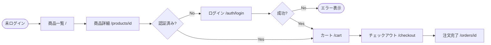
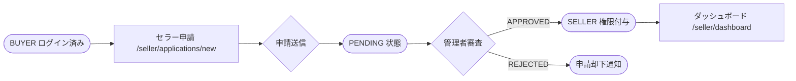

# フロントエンド設計・実装手順書（Claude Code 専用版）

**作成日：** 2026年5月31日  
**対象プロジェクト：** Kivio  
**対象スタック：** Next.js (App Router) + shadcn/ui + Tailwind CSS  
**実行環境：** Claude Code（外部デザインツール不要）  
**参照元：** `docs/requirements/REQUIREMENTS.md`、`docs/design/API_DESIGN.md`

---

## 目次

1. [概要・設計フローの全体像](#1-概要設計フローの全体像)
2. [Step 1 — 設計思考ドキュメント（User Flow + IA）](#2-step-1--設計思考ドキュメントuser-flow--ia)
3. [Step 2 — デザインシステム初期化](#3-step-2--デザインシステム初期化)
4. [Step 3 — 共通コンポーネント構築](#4-step-3--共通コンポーネント構築)
5. [Step 4 — 画面ごとの実装（反復）](#5-step-4--画面ごとの実装反復)
6. [Step 5 — API コントラクト（フロント視点）](#6-step-5--api-コントラクトフロント視点)
7. [Claude Code スキル一覧](#7-claude-code-スキル一覧)

---

## 1. 概要・設計フローの全体像

### 1.1 この手順書の目的

本手順書は **Claude Code のみ**でフロントエンド設計から実装までを完結させるためのフロー。  
「設計 → 仕様化 → 実装」という従来の 3 段階を「設計 → 直接実装」の 2 段階に圧縮し、  
Figma / draw.io 等の外部ツールへの切り替えコストをゼロにする。

### 1.2 Figmaワークフローとの違い

| 工程 | Figma ワークフロー | Claude Code 専用ワークフロー |
|---|---|---|
| User Flow | draw.io / FigJam で描く | **Mermaid ダイアグラム（Markdown 内）** |
| Lo-fi ワイヤーフレーム | Figma でグレースケール画面を作る | **不要（直接コード生成）** |
| デザインシステム | Figma Variables と CSS を別管理 | **`globals.css` + `tailwind.config.ts` のみ（コード一元管理）** |
| Hi-fi モックアップ | Figma で完成形を作りコードに起こす | **`/frontend-design` スキルでコードを直接生成** |
| Interaction Spec | Figma アノテーションとして別ドキュメント化 | **コンポーネントに実装として組み込む** |
| API コントラクト | Markdown | **Markdown（同じ）** |

### 1.3 フロー全体図

```
要件定義書 / API 設計書
        ↓
 Step 1  設計思考ドキュメント   ← User Flow（Mermaid）+ IA（URL一覧・ナビ構造）
        ↓
 Step 2  デザインシステム初期化  ← globals.css + tailwind.config.ts + shadcn/ui テーマ
        ↓
 Step 3  共通コンポーネント構築  ← Layout / Navbar / 共通 UI を /frontend-design で生成
        ↓
 Step 4  画面ごとの実装（反復）  ← 1画面ずつ生成 → ブラウザ確認 → フィードバック → 修正
        ↓
 Step 5  API コントラクト       ← FRONTEND_API_CONTRACT.md を作成
        ↓
    バックエンドと結合・E2E テスト
```

> **進め方の原則:** Step 1 はコードを書かない唯一のステップ。  
> Step 2 以降は「生成 → ブラウザ確認 → 修正」のサイクルで進める。  
> 後の工程で前の工程に戻ることは正常（特に Step 2 のカラーは Step 4 まで調整が続く）。

### 1.4 品質基準

Claude Code の `/frontend-design` スキルは以下を保証するよう設計されている:

- production-grade のコード品質（汎用的な AI 生成 UI の見た目を避ける）
- shadcn/ui コンポーネントを適切に活用したアクセシブルな実装
- Loading / Error / Empty の 3 状態をコンポーネントに標準で含める
- モバイルファースト（375px）・デスクトップ（1280px）のレスポンシブ対応

---

## 2. Step 1 — 設計思考ドキュメント（User Flow + IA）

### 目的

コードを書く前に「ユーザーがどう動くか」と「何が・どこにあるか」を文書化する。  
Claude Code に渡すインプットとしても機能するため、具体的に書くほど生成品質が上がる。

### ツール

Claude Code（Markdown + Mermaid）のみ。外部ツール不要。

### 2.1 ユーザーフロー（Mermaid）

`docs/design/USER_FLOW.md` として作成する。Mermaid の `flowchart` 記法を使用。

**記述例（バイヤー購入フロー）:**



**記述例（セラー申請フロー）:**



### 2.2 情報アーキテクチャ（IA）

`docs/design/FRONTEND_IA.md` として作成する。

**画面 URL 一覧（パス・ロール制限・認証要否）:**

```
パス                              ロール制限              認証
/                                 全ユーザー              不要
/products/[id]                    全ユーザー              不要
/shops/[id]                       全ユーザー              不要
/search                           全ユーザー              不要
/auth/login                       未認証のみ              不要
/auth/register                    未認証のみ              不要
/cart                             BUYER 以上              必要
/checkout                         BUYER 以上              必要
/orders/[id]                      本人のみ                必要
/wishlist                         BUYER 以上              必要
/messages                         BUYER / SELLER          必要
/seller/dashboard                 SELLER 以上             必要
/seller/products                  SELLER 以上             必要
/seller/products/new              SELLER 以上             必要
/seller/products/[id]/edit        SELLER（本人）          必要
/seller/orders                    SELLER 以上             必要
/seller/applications/new          BUYER（申請未済）        必要
/admin/users                      ADMIN のみ              必要
/admin/seller-applications        ADMIN のみ              必要
```

**ナビゲーション構造:**

```
グローバルヘッダー（全画面共通）
├── 未認証:    ロゴ / 商品検索 / ログイン / 新規登録
├── BUYER:     ロゴ / 商品検索 / お気に入り / カート / アカウントメニュー
├── SELLER:    ロゴ / 商品検索 / カート / セラー管理 / アカウントメニュー
└── ADMIN:     ロゴ / 管理メニュー / アカウントメニュー

セラーサイドナビ（/seller/* 共通）
├── ダッシュボード概要
├── 商品管理
├── 注文管理
└── ショップ設定
```

### 2.3 デザイン方針書

`/ui-ux-pro-max` スキルを使ってカラーパレットとフォントペアを決定する前に、  
以下の方針を先に Markdown で記述しておく。

```markdown
## Kivio デザイン方針

ターゲット印象: 信頼感・親しみやすさ・ECとしての明瞭さ
スタイル方向: ミニマル・クリーン（過度な装飾を避ける）
カラー方向: [暖色系 / 中性系 / クール系] ← /ui-ux-pro-max で選定
フォント: Noto Sans JP（日本語必須）+ 欧文フォント（/ui-ux-pro-max で選定）
ダークモード: 対応する（shadcn/ui のテーマ切替）
```

### 期待成果物

- [ ] `docs/design/USER_FLOW.md`（Mermaid フロー図 3 種：バイヤー・セラー・管理者）
- [ ] `docs/design/FRONTEND_IA.md`（URL 一覧・ナビゲーション構造・コンテンツ優先順位）
- [ ] デザイン方針書（`FRONTEND_IA.md` 内、または独立ファイル）

#### Kivio Phase 2 チェックリスト

- [ ] バイヤー：購入フロー・認証フロー・未認証リダイレクトフローの Mermaid 図
- [ ] セラー：申請 → 承認 → 商品登録フローの Mermaid 図
- [ ] 管理者：セラー承認フローの Mermaid 図
- [ ] Phase 2 対象 URL（上表の `/auth/*` / `/seller/*` / `/admin/*` 初期ページ）の IA 確定
- [ ] グローバルヘッダーの 4 状態（未認証・BUYER・SELLER・ADMIN）を定義

---

## 3. Step 2 — デザインシステム初期化

### 目的

色・フォント・余白の**設計変数（Design Token）**をコードで一元定義する。  
Step 4 以降の全コンポーネント生成がこのトークンを参照するため、最初に確定させる。

### ツール

Claude Code + `/ui-ux-pro-max` スキル（カラー・フォント選定に使用）

### 3.1 カラーパレット選定

`/ui-ux-pro-max` スキルに以下を伝えて選定する:

```
Kivio（マルチベンダー EC）向けのカラーパレットを提案してください。
方針: 信頼感・親しみやすさ、ミニマルスタイル
shadcn/ui の CSS 変数（--primary / --secondary 等）に対応する形で
Light / Dark テーマ両方を提案してください。
```

### 3.2 生成するファイル

**`globals.css`（shadcn/ui CSS 変数）:**

```css
@layer base {
  :root {
    --background: /* ライトテーマ背景 */;
    --foreground: /* 主要テキスト */;
    --primary:    /* ブランドカラー */;
    --primary-foreground: /* primary 上のテキスト */;
    --secondary:  /* サブカラー */;
    --destructive:/* エラー・削除（赤系） */;
    --muted:      /* 補助テキスト */;
    --border:     /* ボーダー */;
    --ring:       /* フォーカスリング */;
    --radius:     0.5rem;
  }
  .dark {
    /* ダークテーマ変数 */
  }
}
```

**`tailwind.config.ts`（フォント・拡張トークン）:**

```ts
import type { Config } from 'tailwindcss'

const config: Config = {
  darkMode: ['class'],
  content: ['./src/**/*.{ts,tsx}'],
  theme: {
    extend: {
      fontFamily: {
        sans: ['Noto Sans JP', 'var(--font-geist-sans)', 'sans-serif'],
      },
      // shadcn/ui のカラートークンを CSS 変数から参照
      colors: {
        background: 'hsl(var(--background))',
        foreground: 'hsl(var(--foreground))',
        primary: {
          DEFAULT: 'hsl(var(--primary))',
          foreground: 'hsl(var(--primary-foreground))',
        },
        // ...
      },
    },
  },
  plugins: [require('tailwindcss-animate')],
}
export default config
```

### 3.3 共通コンポーネント分類

| 分類 | コンポーネント | ベース |
|---|---|---|
| Atoms | `Button`, `Input`, `Badge`, `Avatar`, `Skeleton`, `Separator` | shadcn/ui |
| Molecules | `ProductCard`, `PriceTag`, `RatingStars`, `SearchBar`, `EmptyState`, `ErrorFallback` | カスタム |
| Organisms | `Navbar`, `Footer`, `SellerSidebar`, `ProductGrid`, `CheckoutForm` | カスタム |
| Layout | `RootLayout`, `AuthLayout`, `SellerLayout`, `AdminLayout` | Next.js Layout |

### 期待成果物

- [ ] `globals.css`（Light / Dark の CSS 変数が定義済み）
- [ ] `tailwind.config.ts`（フォント・カラートークン・アニメーション設定済み）
- [ ] `components.json`（shadcn/ui の初期設定）
- [ ] 使用する shadcn/ui コンポーネントのインストール完了
  - `Button`, `Input`, `Form`, `Card`, `Badge`, `Avatar`, `Skeleton`
  - `Dialog`, `Sheet`, `Tabs`, `Table`, `DropdownMenu`, `Toast`

#### Kivio Phase 2 チェックリスト

- [ ] `/ui-ux-pro-max` でカラーパレット決定 → `globals.css` に反映
- [ ] `/ui-ux-pro-max` でフォントペア決定 → `tailwind.config.ts` に `Noto Sans JP` + 欧文フォント設定
- [ ] `npx shadcn@latest init` で初期化（`components.json` 生成）
- [ ] Phase 2 で使う shadcn/ui コンポーネントを一括インストール
- [ ] ダークモード切替の動作確認（`ThemeProvider` の設定）

---

## 4. Step 3 — 共通コンポーネント構築

### 目的

全画面で使う基盤 UI（Layout・Navbar・共通コンポーネント）を先に作り、  
Step 4 の画面実装を「中身を埋めるだけ」の状態にする。

### ツール

Claude Code + `/frontend-design` スキル

### 4.1 `/frontend-design` スキルへの渡し方

効果的なプロンプトの書き方:

```
# 良い例
/frontend-design
Kivio（日本語マルチベンダー EC）の Navbar を実装してください。
- スタック: Next.js App Router + shadcn/ui + Tailwind CSS
- 状態: 未認証 / BUYER / SELLER / ADMIN の 4 状態で表示を切り替える
- 未認証: ロゴ・検索バー・「ログイン」「新規登録」ボタン
- BUYER: ロゴ・検索バー・ハートアイコン（お気に入り）・カートアイコン（件数バッジ）・アバターメニュー
- モバイルはハンバーガーメニューで Sheet コンポーネントを使う
- スタイル: ミニマル・クリーン。ボーダーボトムで区切る

# 悪い例（情報が少なすぎる）
/frontend-design
ナビバーを作って
```

### 4.2 インタラクション状態の実装方針

Figma での別途仕様書は不要。コンポーネント内に直接実装する。

| 状態 | 実装方法 |
|---|---|
| **Loading / Skeleton** | shadcn/ui の `<Skeleton>` を使ったローカルコンポーネントを用意 |
| **Empty State** | `<EmptyState icon title description action />` の汎用コンポーネントを作成 |
| **Error State** | `error.tsx`（Next.js）+ インライン `<ErrorFallback>` コンポーネント |
| **Disabled** | shadcn/ui の `disabled` prop + `aria-disabled` で統一 |
| **Hover / Focus** | Tailwind の `hover:` / `focus-visible:` クラスで実装 |

**アニメーション統一値（`tailwind.config.ts` の `transitionDuration` に追加）:**

| 用途 | duration | easing |
|---|---|---|
| ボタン Hover | `100ms` | `ease-in` |
| モーダル / Sheet | `200ms` | `ease-out` |
| ページ遷移 | `150ms` | `ease-in-out` |
| Skeleton パルス | `1500ms`（ループ） | `ease-in-out` |
| Toast 表示 / 消去 | `300ms` / `200ms` | `ease-in-out` |

### 期待成果物

- [ ] `src/components/layout/Navbar.tsx`（4 状態対応・モバイルメニュー付き）
- [ ] `src/components/layout/Footer.tsx`
- [ ] `src/components/layout/SellerSidebar.tsx`
- [ ] `src/components/ui/EmptyState.tsx`（汎用 Empty State）
- [ ] `src/components/ui/ErrorFallback.tsx`（汎用エラー表示）
- [ ] `src/components/product/ProductCard.tsx`（Skeleton 状態含む）
- [ ] `src/components/product/ProductGrid.tsx`（グリッド + Skeleton ローディング）
- [ ] `src/app/layout.tsx`（ルートレイアウト + ThemeProvider）
- [ ] `src/app/(auth)/layout.tsx`（認証画面専用レイアウト）
- [ ] `src/app/(seller)/layout.tsx`（セラー画面専用レイアウト + サイドナビ）

#### Kivio Phase 2 チェックリスト

- [ ] `Navbar`: 4 状態（未認証・BUYER・SELLER・ADMIN）をブラウザで確認
- [ ] `ProductCard`: Default / Skeleton / Hover の 3 状態を確認
- [ ] `EmptyState`: アイコン・タイトル・説明文・アクションボタンのパターンを確認
- [ ] セラーサイドナビ：現在のページのアクティブ状態をブラウザで確認
- [ ] `pnpm dev` でモバイル(375px)・デスクトップ(1280px) の両サイズを確認

---

## 5. Step 4 — 画面ごとの実装（反復）

### 目的

Step 3 で構築した共通コンポーネントを組み合わせ、各画面を 1 つずつ完成させる。  
「生成 → ブラウザ確認 → 修正」のサイクルを 1 画面あたり繰り返す。

### ツール

Claude Code + `/frontend-design` スキル + `pnpm dev`（ブラウザ確認）

### 5.1 実装順序（Phase 2 推奨）

依存関係の少ない画面から順に実装する:

```
① ログイン・新規登録（/auth/login, /auth/register）
      ↓ 認証基盤が完成してから
② ホーム・商品一覧（/）
③ 商品詳細（/products/[id]）
      ↓ 商品表示の完成形を確認してから
④ セラー申請フォーム（/seller/applications/new）
⑤ セラーダッシュボード（/seller/dashboard）
⑥ 商品管理・登録フォーム（/seller/products, /seller/products/new）
⑦ 管理者：セラー申請一覧（/admin/seller-applications）
```

### 5.2 画面ごとのプロンプト例

**ログイン画面の例:**

```
/frontend-design
Kivio のログイン画面（/auth/login）を実装してください。

コンテキスト:
- Kivio は日本語 UI のマルチベンダー EC
- スタック: Next.js App Router + shadcn/ui + Tailwind CSS
- AuthLayout（ロゴ + カード中央配置）を使用する

要件:
- メールアドレス + パスワードフォーム（react-hook-form + zod）
- Google OAuth ボタン（shadcn/ui Button variant="outline" + Google アイコン）
- バリデーションエラーのインライン表示
- 送信中のボタン無効化 + ローディングスピナー
- 新規登録ページへのリンク
- モバイル(375px) / デスクトップ(1280px) 対応
```

**商品詳細の例:**

```
/frontend-design
Kivio の商品詳細画面（/products/[id]）を実装してください。

コンテキスト:
- Kivio は日本語 UI のマルチベンダー EC（shadcn/ui + Tailwind CSS）

要件:
- 左カラム: 画像ギャラリー（メイン画像 + サムネイル列）
- 右カラム: 商品名・価格（¥形式・整数）・在庫状況・購入ボタン・ショップ情報
- 購入ボタン: モバイルはページ下部スティッキー、デスクトップは通常配置
- 下部: タブ（商品説明 / レビュー一覧）
- Skeleton ローディング状態を含める
- 在庫切れ時は購入ボタンを Disabled にしてメッセージ表示
```

### 5.3 確認・修正サイクル

各画面の生成後に以下を確認してから次の画面へ進む:

```
pnpm dev でブラウザを開く
  ↓
[ ] モバイル(375px): レイアウト崩れなし
[ ] デスクトップ(1280px): レイアウト崩れなし
[ ] ダークモード: 色・コントラスト問題なし
[ ] Loading 状態: Skeleton が正しく表示される
[ ] Empty State: データなし時のメッセージが表示される
[ ] フォームのバリデーションエラーが正しく表示される
  ↓
問題があれば Claude Code に修正依頼 → 再確認
```

### 期待成果物

Phase 2 全 7 画面:

- [ ] `src/app/(auth)/login/page.tsx`（メール/パスワード + Google OAuth）
- [ ] `src/app/(auth)/register/page.tsx`（新規登録フォーム）
- [ ] `src/app/page.tsx`（ホーム: 商品グリッド + 検索バー）
- [ ] `src/app/products/[id]/page.tsx`（商品詳細: 画像 + 購入ボタン + タブ）
- [ ] `src/app/(seller)/applications/new/page.tsx`（セラー申請フォーム）
- [ ] `src/app/(seller)/dashboard/page.tsx`（KPI カード + 直近注文テーブル）
- [ ] `src/app/(seller)/products/page.tsx` + `new/page.tsx`（商品管理 + 登録フォーム）
- [ ] `src/app/not-found.tsx`（404 ページ）
- [ ] `src/app/error.tsx`（500 エラーページ）

#### Kivio Phase 2 チェックリスト

- [ ] ログイン画面: バリデーションエラー（メール形式不正・パスワード必須）を手動確認
- [ ] 商品一覧: Skeleton ローディング状態をブラウザで確認
- [ ] 商品詳細: モバイルでの購入ボタン スティッキー配置を確認
- [ ] 商品詳細: 在庫切れ状態（Disabled ボタン + メッセージ）を確認
- [ ] セラーダッシュボード: サイドナビのアクティブ状態を確認
- [ ] 商品登録フォーム: 送信中のボタン無効化 + スピナーを確認
- [ ] 全画面: ダークモード切替で色の問題がないことを確認

---

## 6. Step 5 — API コントラクト（フロント視点）

### 目的

バックエンドの `docs/design/API_DESIGN.md` とは別に、**フロントエンドが何を必要としているか**を整理する。  
実装開始前に作成し、バックエンドとの認識ズレを防ぐ。

### ツール

Claude Code（Markdown）— `docs/design/FRONTEND_API_CONTRACT.md` として作成

### 6.1 画面 × API 対応表

| 画面 | メソッド | エンドポイント | 必要なフィールド |
|---|---|---|---|
| 商品一覧 | GET | `/api/v1/products` | `id`, `name`, `price`, `images[0]`, `shop.name`, `rating` |
| 商品詳細 | GET | `/api/v1/products/{id}` | 全フィールド |
| 商品詳細 | GET | `/api/v1/products/{id}/reviews` | `id`, `rating`, `comment`, `user.name`, `createdAt` |
| カート | GET | `/api/v1/cart` | `items[].productId`, `items[].quantity`, `items[].price` |
| カート追加 | POST | `/api/v1/cart/items` | — |
| チェックアウト | POST | `/api/v1/orders/checkout` | レスポンス: `orderId`, `clientSecret`（Stripe）|
| セラー申請 | POST | `/api/v1/seller-applications` | `shopName`, `category`, `description` |
| 商品登録 | POST | `/api/v1/products` | `name`, `price`, `categoryId`, `images[]`, `description` |

### 6.2 データ依存関係（並列フェッチ可否）

```ts
// 商品詳細: 並列取得可能
const [product, reviews] = await Promise.all([
  fetchProduct(id),
  fetchProductReviews(id),
])

// セラーダッシュボード: 並列取得可能
const [stats, recentOrders, products] = await Promise.all([
  fetchSellerStats(),
  fetchRecentOrders({ limit: 5 }),
  fetchSellerProducts({ limit: 10 }),
])

// チェックアウト: カート取得 → 注文作成（順序依存）
const cart = await fetchCart()
const order = await checkout(cart)
```

### 6.3 エラーコード → UI メッセージ対応表

（`docs/design/ERROR_CODES.md` を参照して全エラーを網羅する）

| エラーコード | HTTP | UI 表示方法 | メッセージ |
|---|---|---|---|
| `UNAUTHORIZED` | 401 | ログイン画面へリダイレクト | — |
| `FORBIDDEN` | 403 | エラーページ表示 | 「このページへのアクセス権がありません」|
| `PRODUCT_NOT_FOUND` | 404 | not-found.tsx | 「商品が見つかりませんでした」|
| `PRODUCT_OUT_OF_STOCK` | 409 | インライン（購入ボタン付近） | 「この商品は現在在庫切れです」|
| `CART_ITEM_NOT_FOUND` | 404 | Toast（エラー） | 「カートに商品が見つかりませんでした」|
| `SELLER_APPLICATION_ALREADY_EXISTS` | 409 | フォームエラー | 「すでに申請が存在します」|

### 6.4 グローバルエラーハンドリング

```ts
// src/lib/api-client.ts: 401 をグローバルにインターセプト
// src/middleware.ts: 認証が必要なパスへの未認証アクセスを /auth/login にリダイレクト
```

### 期待成果物

- [ ] `docs/design/FRONTEND_API_CONTRACT.md`（全画面の API 対応表）
- [ ] 各画面のデータ依存関係（並列フェッチ可否・ウォーターフォール有無）
- [ ] エラーコード → UI メッセージ対応表（主要エラーを網羅）
- [ ] `src/middleware.ts` の認証ガード設計（どのパスに認証が必要か）

#### Kivio Phase 2 チェックリスト

- [ ] Phase 2 全画面の API 対応表を作成
- [ ] セラーダッシュボードの並列フェッチ設計（stats / orders / products）
- [ ] `401` のグローバルハンドリング設計（`api-client.ts` + `middleware.ts`）
- [ ] `PRODUCT_OUT_OF_STOCK` / `SELLER_APPLICATION_ALREADY_EXISTS` の UI メッセージ確定

---

## 7. Claude Code スキル一覧

本手順書で使用する Claude Code スキルの概要。

### `/frontend-design`

**用途:** production-grade のフロントエンドコンポーネント・ページを生成する。

```
# 使用タイミング
- Step 3: 共通コンポーネント（Navbar, ProductCard 等）の実装
- Step 4: 各画面（ログイン, 商品詳細, ダッシュボード等）の実装
- 既存コンポーネントの UI 品質改善
```

**効果的なプロンプトの要素:**
1. コンテキスト（プロジェクト名・スタック・ターゲット）
2. 使用するレイアウト・既存コンポーネント
3. 機能要件（フォーム・状態・バリデーション等）
4. レスポンシブ要件（対応ブレークポイント）

---

### `/ui-ux-pro-max`

**用途:** デザインシステムの意思決定（カラーパレット・フォントペア・スタイル選択）。  
161 のカラーパレット・57 のフォントペア・50 以上のスタイルから最適な組み合わせを提案する。

```
# 使用タイミング
- Step 2: カラーパレット・フォントの選定
- Step 2 以降: デザインの一貫性チェック・改善提案
```

**プロンプト例:**
```
/ui-ux-pro-max
Kivio（マルチベンダー EC）向けに shadcn/ui で使えるカラーパレットと
フォントペアを提案してください。
- 印象: 信頼感・親しみやすさ・日本語 UI
- スタイル: ミニマル・クリーン
- 必須: Light / Dark テーマ両対応
```

---

### `/web-design-guidelines`

**用途:** 実装済みの UI をアクセシビリティ・UX ガイドラインに照らして審査する。

```
# 使用タイミング
- Step 4 完了後: 各画面の品質チェック
- バックエンド結合前の最終確認
```
